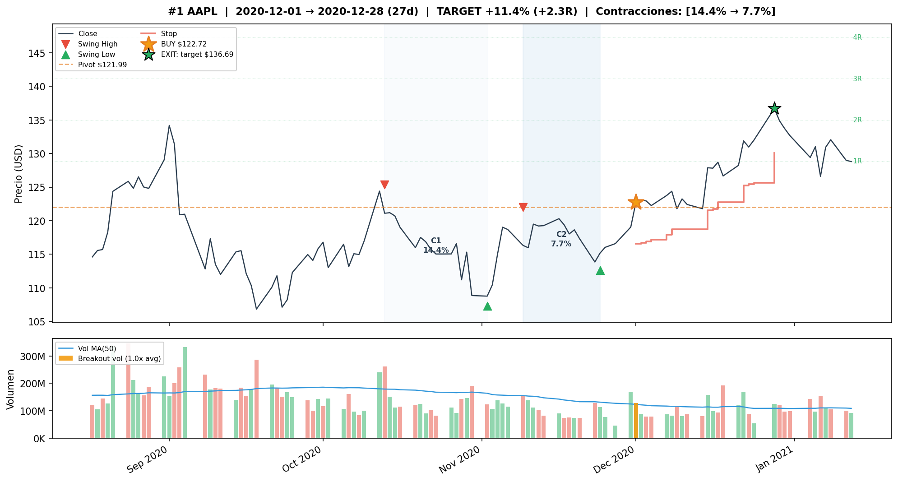
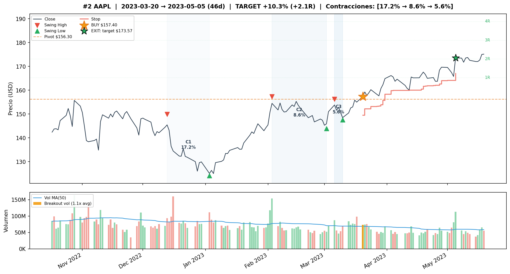
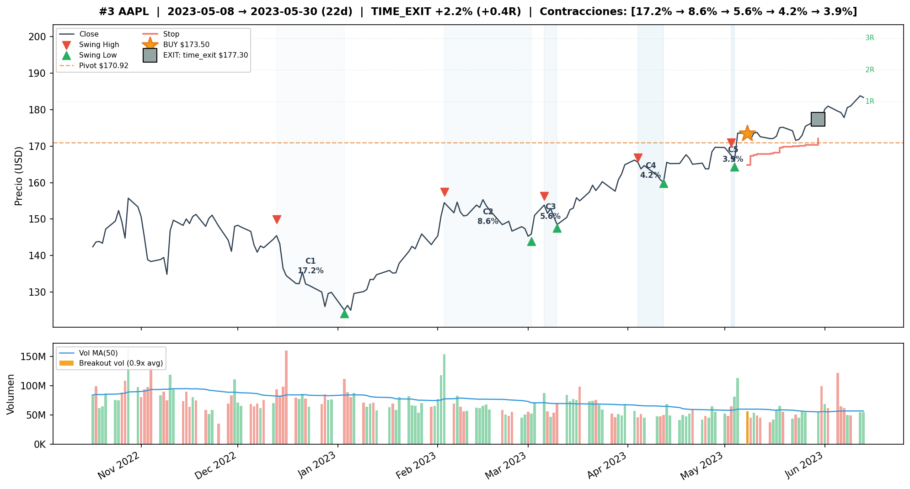
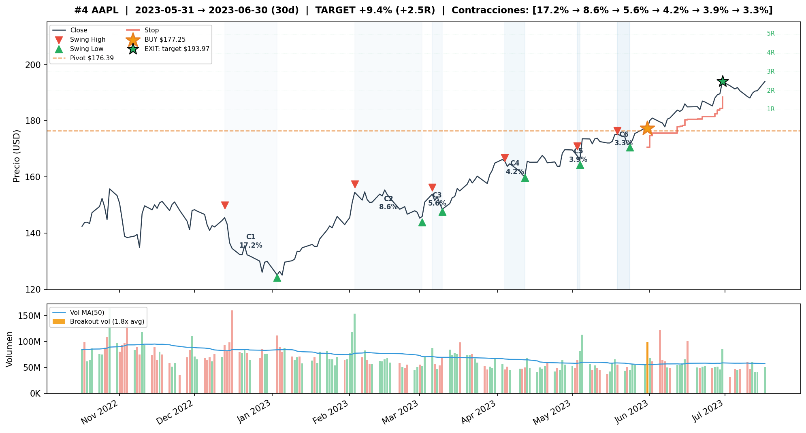
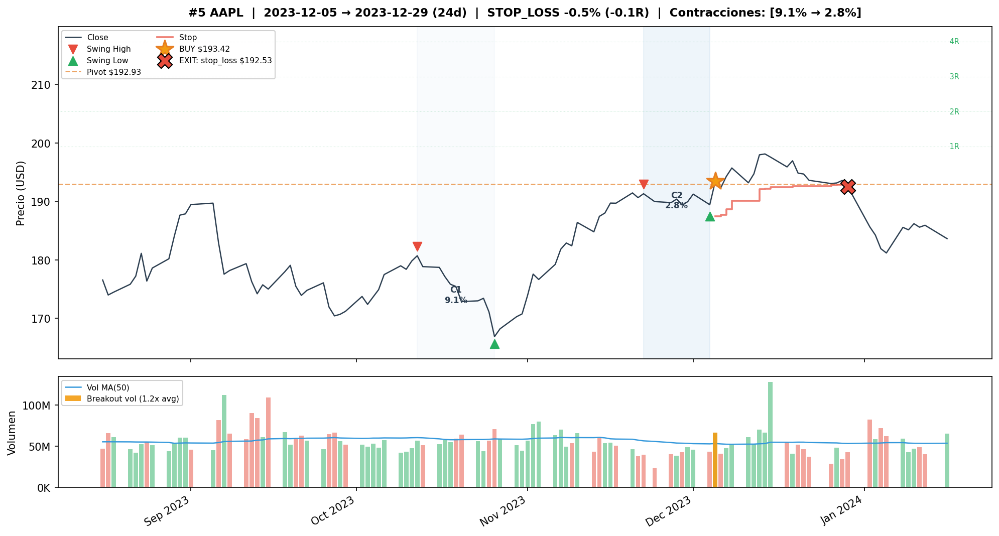
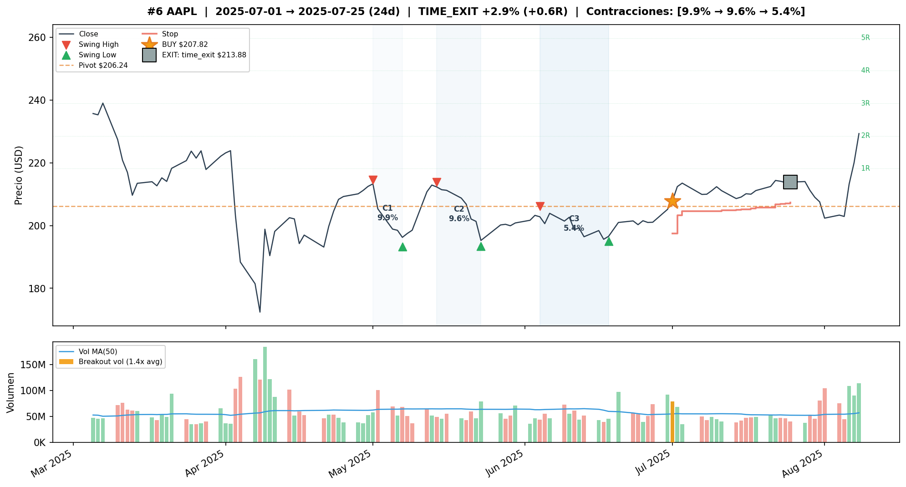
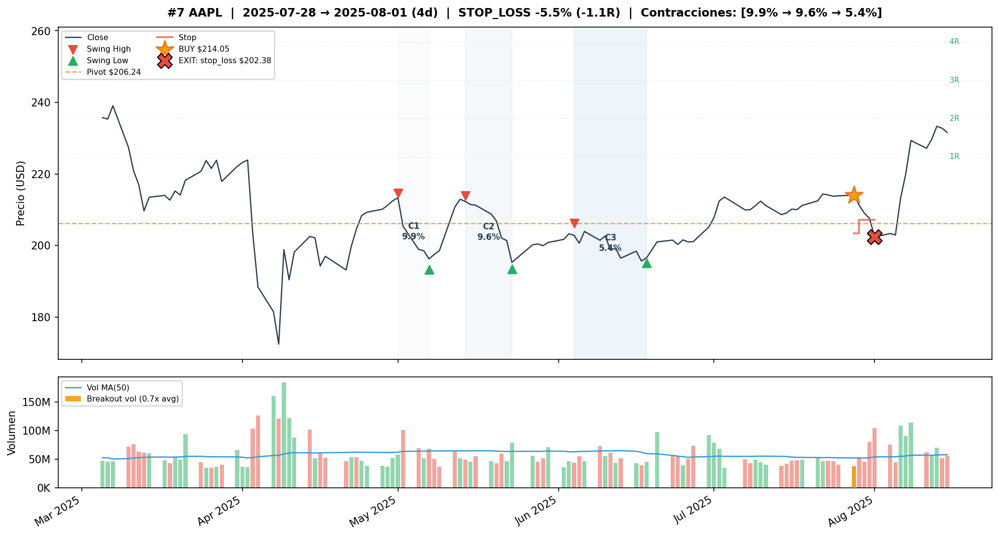
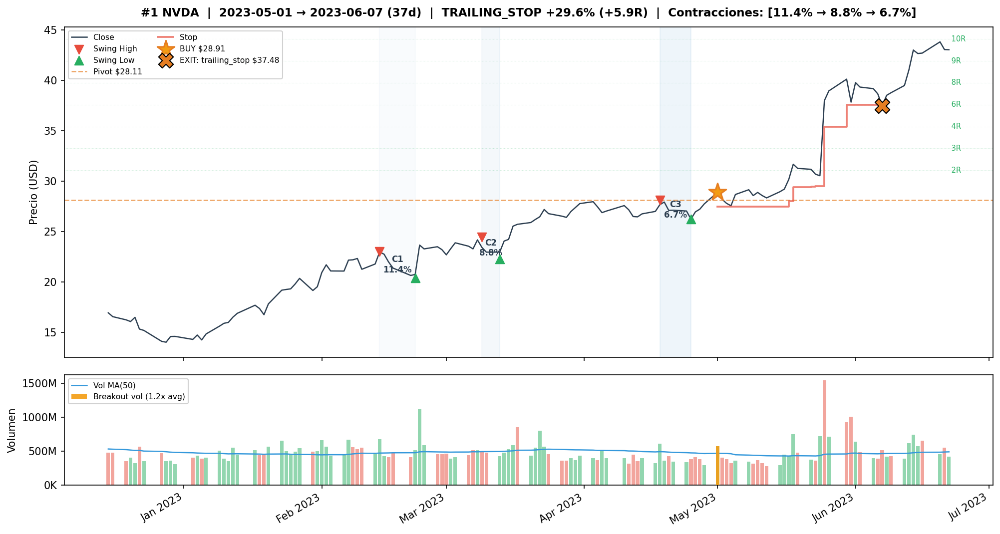
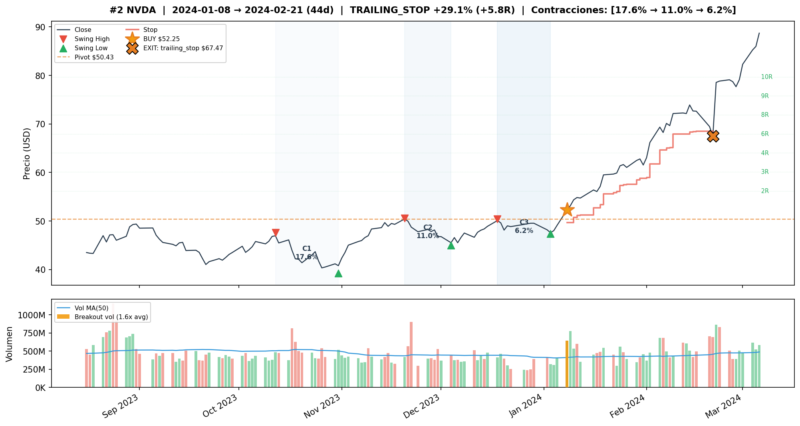
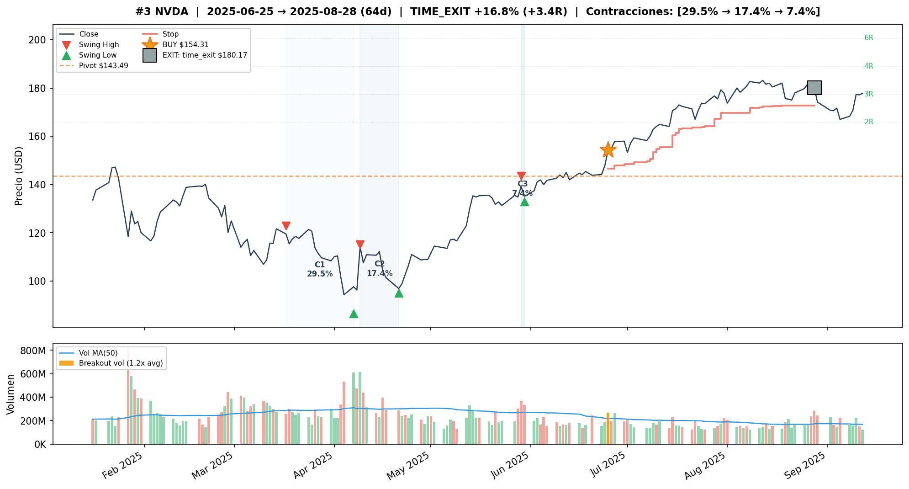

# Informe: Optimizacion VCP per-ticker en stocks (v2)

## Contexto

Este informe documenta el experimento de optimizacion profunda del detector VCP
para 5 acciones individuales: AAPL, AMZN, GOOGL, MSFT y NVDA. El objetivo es
determinar si los parametros optimos del detector son transferibles entre activos
o si cada ticker requiere calibracion individual.

**Data:** OHLCV diario de cada ticker.
**Split:** TRAIN 2015-2019 (1,258 barras) / TEST 2020-2026 (1,574 barras).
**Modo:** Sequential (un trade a la vez, sin overlap).

Este es el experimento mas grande del proyecto: 734,832 evaluaciones por ticker
en Fase 1, mas ~14,000 evaluaciones en Fase 2, para un total de ~3.7 millones
de evaluaciones across los 5 tickers.

---

## Metodologia

El experimento se ejecuta en 2 fases con seleccion multi-criterio.

### Fase 1 — Deteccion (734,832 evaluaciones por ticker)

Se corren 17,496 pipeline runs (las ejecuciones costosas del detector VCP), y cada
una se evalua con 2 variantes de Trend Template × 7 variantes de volumen en breakout
× 3 perfiles de salida fijos = 42 evaluaciones por pipeline run.

Las 3 salidas fijas (tight trail=1.5, medium trail=2.5, loose trail=3.5) sirven para
rankear las configs de deteccion de forma robusta: si una config solo funciona con
un trailing especifico, es fragil. Se promedian las metricas de las 3 salidas y se
rankea por ese promedio.

Esto produce 244,944 configs de deteccion unicas (promediando las 3 salidas).

**Seleccion:** Se toman los top 10 por CR + top 10 por WR (sin duplicados) → ~15-20
candidatos por ticker.

### Fase 2 — Salida (~14,000 evaluaciones por ticker)

Para cada candidato seleccionado, se evaluan 720 configuraciones de salida completas.
Se aplica un ranking compuesto: 50% CR + 30% WR + 20% avg_R.

Las top 3 configs por composite se evaluan en datos out-of-sample (TEST 2020-2026).

---

## Parametros variados

### Fase 1 — Deteccion (12 parametros)

| Parametro | Valores | Por que se varia |
|---|---|---|
| atr_mult | 2.0, 3.0, 4.0 | Escala de swings. 2.0 fue optimo en stocks_sequential, pero se explora 3.0 y 4.0 para ver si patrones de mayor escala funcionan mejor per-ticker. |
| use_close_only | False (HL), True (Close) | HL captura extremos intradiarios, Close es mas conservador. Se descubrio que GOOGL necesita Close mientras los demas funcionan con HL. |
| max_depth_atr | None, 6, 8 | Profundidad maxima en ATRs. None deshabilita el filtro. Se varia porque la interaccion con atr_mult es compleja (atr_mult alto + max_depth_atr bajo puede bloquear todo). |
| min_total_reduction | 0.40, 0.60, 0.80 | Cuanta contraccion total exigir. 0.80 = la ultima contraccion debe ser 80% menor que la primera. Valores altos exigen patrones VCP mas "limpios". |
| lookback_bars | 63, 126 | Ventana temporal de 3 o 6 meses. La mayoria de tickers prefiere 126, pero NVDA tiene ciclos mas cortos y prefiere 63. |
| compression_threshold | 0.85, 0.90, 0.95 | Exigencia de compresion de ATR. 0.85 = ATR debe reducirse al menos 15%. 0.95 = solo 5% de reduccion exigida. |
| tolerance | 0.10, 0.15, 0.20 | Margen para secuencia "casi" decreciente. Resulto inerte en la mayoria de tickers. |
| max_depth_pct | 0.25, 0.30, 0.35 | Profundidad maxima individual. 0.35 = limite de Minervini. Inerte en AAPL (contracciones nunca exceden 25%). |
| ascending_lows_tolerance | 0.01, 0.03, 0.08 | Margen para lows ascendentes. Inerte en la mayoria de tickers. |
| trend_template | False, True | Filtro de Etapa 2 de Minervini. False gano en todos los tickers (confirmado en experimentos previos). |
| volume_contraction | None, ratio<=0.85 | Si exigir que el volumen decrezca durante la formacion del patron. |

### Post-filtro de volumen en breakout (7 variantes)

| Variante | Ventana | Threshold | Descripcion |
|---|---|---|---|
| no_filter | — | — | Sin filtro de volumen en breakout |
| w1_t1.2 | 1 dia | 1.2x | Volumen 20% arriba del promedio, dia exacto |
| w1_t1.5 | 1 dia | 1.5x | Volumen 50% arriba, dia exacto |
| w3_t1.2 | 3 dias | 1.2x | Volumen 20% arriba en alguno de ultimos 3 dias |
| w3_t1.5 | 3 dias | 1.5x | Volumen 50% arriba en ultimos 3 dias |
| w5_t1.2 | 5 dias | 1.2x | Volumen 20% arriba en ultimos 5 dias |
| w5_t1.5 | 5 dias | 1.5x | Volumen 50% arriba en ultimos 5 dias |

### Fase 2 — Salida (5 parametros, 720 combinaciones)

| Parametro | Valores | Por que se varia |
|---|---|---|
| trailing_atr_multiplier | 1.0, 1.5, 2.0, 2.5, 3.0 | Que tan apretado el trailing stop. Valores bajos toman ganancias rapido pero se activan con ruido; altos dejan correr pero devuelven mas ganancia en retrocesos. |
| target_r_multiple | None, 2.0, 3.0, 5.0 | Take profit fijo en multiplos de riesgo. None = sin target, dejar correr. 2R = salir rapido, liberar capital. 5R = solo home runs. |
| early_exit_days | None, 3, 5 | Salir si el precio esta debajo del entry despues de N dias. |
| breakeven_r_multiple | 0.5, 1.0, 1.5, 2.0 | Cuando mover el stop al precio de entrada. |
| max_stop_loss_pct | 0.03, 0.05, 0.07 | Stop loss maximo. 3% agresivo, 7% conservador. |

### Parametros fijos

| Parametro | Valor | Razon |
|---|---|---|
| atr_length | 14 | Estandar de la industria |
| min_contractions | 2 | Definicion minima de VCP |
| max_contractions | 6 | Tope razonable |
| volume_lookback_days | 50 | Baseline para promedio de volumen |
| max_bars_without_progress | 15 | Optimizado en estudio AAPL v1 |
| min_progress_r | 0.5 | Optimizado en estudio AAPL v1 |
| trailing_stop_method | "atr" | Mejor metodo encontrado |

---

## Resultados por ticker

### AAPL — Mejor generalizacion

**Config ganadora (COMP#1):**

| Grupo | Parametro | Valor |
|---|---|---|
| Deteccion | atr_mult | 2.0 |
| Deteccion | use_close_only | False (HL) |
| Deteccion | max_depth_atr | 6 |
| Deteccion | min_total_reduction | 0.80 |
| Deteccion | lookback_bars | 126 |
| Deteccion | compression_threshold | 0.85 |
| Deteccion | trend_template | False |
| Deteccion | volume_contraction | True (ratio<=0.85) |
| Deteccion | vol_filter | no_filter |
| Salida | trailing_atr_multiplier | 2.0 |
| Salida | target_r_multiple | 2.0 |
| Salida | breakeven_r_multiple | 1.0 |
| Salida | max_stop_loss_pct | 0.05 |

**Resultados:**

| Metrica | TRAIN | TEST | B&H TEST |
|---|---|---|---|
| Trades | 8 | 7 | — |
| WR | 88% | 71% | — |
| CR | +54.28% | +33.04% | +244.80% |
| MaxDD | -0.95% | -5.45% | -33.43% |
| Sharpe | 1.83 | 2.35 | 0.79 |
| avg_R | +1.13 | +0.94 | — |

**Trades en TEST:**

| # | Entry | Exit | Salida | PnL | R | Dur |
|---|---|---|---|---|---|---|
| 1 | 2020-12-01 | 2020-12-28 | target | +11.38% | +2.3R | 27d |
| 2 | 2023-03-20 | 2023-05-05 | target | +10.27% | +2.1R | 46d |
| 3 | 2023-05-08 | 2023-05-30 | time_exit | +2.19% | +0.4R | 22d |
| 4 | 2023-05-31 | 2023-06-30 | target | +9.43% | +2.5R | 30d |
| 5 | 2023-12-05 | 2023-12-29 | stop_loss | -0.46% | -0.1R | 24d |
| 6 | 2025-07-01 | 2025-07-25 | time_exit | +2.92% | +0.6R | 24d |
| 7 | 2025-07-28 | 2025-08-01 | stop_loss | -5.45% | -1.1R | 4d |

Graficos de los trades en TEST: `plots/aapl/test/`

**Observaciones AAPL:**
- Excelente generalizacion: Sharpe mejora de 1.83 a 2.35 en TEST.
- 3 de 7 trades salen por target (2R), capturando +9% a +11% cada uno.
- Las 2 perdidas son controladas (-0.46% y -5.45%).
- CR menor que B&H (+33% vs +245%), pero MaxDD drasticamente menor (-5.45% vs -33.43%).

---

### NVDA — Movimientos mas explosivos

**Config ganadora (COMP#2, w3_t1.2):**

| Grupo | Parametro | Valor |
|---|---|---|
| Deteccion | atr_mult | 2.0 |
| Deteccion | use_close_only | False (HL) |
| Deteccion | max_depth_atr | None |
| Deteccion | min_total_reduction | 0.60 |
| Deteccion | lookback_bars | 63 |
| Deteccion | compression_threshold | 0.95 |
| Deteccion | trend_template | False |
| Deteccion | volume_contraction | False |
| Deteccion | vol_filter | w3_t1.2 |
| Salida | trailing_atr_multiplier | 2.5 |
| Salida | target_r_multiple | None (ver nota) |
| Salida | breakeven_r_multiple | 1.5 |
| Salida | max_stop_loss_pct | 0.05 |

**Nota sobre target:** La config ganadora en TRAIN usa target=5R (+96.87% CR). Pero
analisis posterior mostro que target=None es mejor en TEST (+95.43% vs +89.00%) porque
evita liberar capital para un trade perdedor. Se reportan ambos.

**Resultados (target=None en TEST):**

| Metrica | TRAIN (tg=5R) | TEST (tg=None) | B&H TEST |
|---|---|---|---|
| Trades | 6 | 3 | — |
| WR | 67% | 100% | — |
| CR | +96.87% | +95.43% | +2935.78% |
| MaxDD | -10.36% | 0.00% | -66.36% |
| Sharpe | 0.89 | 2.93 | — |
| avg_R | +2.63 | +5.03 | — |

**Trades en TEST (target=None):**

| # | Entry | Exit | Salida | PnL | R | Dur |
|---|---|---|---|---|---|---|
| 1 | 2023-05-01 | 2023-06-07 | trailing_stop | +29.63% | +5.9R | 37d |
| 2 | 2024-01-08 | 2024-02-21 | trailing_stop | +29.13% | +5.8R | 44d |
| 3 | 2025-06-25 | 2025-08-28 | time_exit | +16.76% | +3.4R | 64d |

Graficos de los trades en TEST: `plots/nvda/test/`

**Observaciones NVDA:**
- Solo 3 trades en 6 anos pero todos ganadores (+29.6%, +29.1%, +16.8%).
- NVDA forma pocos VCPs pero cuando los forma, los movimientos son explosivos (AI boom).
- lookback_bars=63 (3 meses) es unico de NVDA — ciclos VCP mas cortos que los demas tickers.
- MaxDD = 0% en TEST con target=None (100% WR).
- CR de +95% vs B&H +2936% — captura una fraccion pero con riesgo incomparablemente menor.

---

### MSFT — Positivo marginal

**Config ganadora (COMP#1):**

| Grupo | Parametro | Valor |
|---|---|---|
| Deteccion | atr_mult | 2.0 |
| Deteccion | use_close_only | False (HL) |
| Deteccion | max_depth_atr | None |
| Deteccion | min_total_reduction | 0.80 |
| Deteccion | lookback_bars | 126 |
| Deteccion | compression_threshold | 0.90 |
| Deteccion | trend_template | False |
| Deteccion | volume_contraction | True (ratio<=0.85) |
| Deteccion | vol_filter | no_filter |
| Salida | trailing_atr_multiplier | 3.0 |
| Salida | target_r_multiple | 2.0 |
| Salida | breakeven_r_multiple | 0.5 |
| Salida | max_stop_loss_pct | 0.05 |

**Resultados:**

| Metrica | TRAIN | TEST | B&H TEST |
|---|---|---|---|
| Trades | 9 | 8 | — |
| WR | 67% | 50% | — |
| CR | +48.17% | +8.41% | +133.05% |
| MaxDD | -0.89% | -9.39% | -37.56% |
| Sharpe | 1.31 | 0.29 | — |
| avg_R | +1.02 | +0.37 | — |

**Observaciones MSFT:**
- Degradacion significativa train→test: CR +48% → +8%, Sharpe 1.31 → 0.29.
- 4 stop losses en TEST (2022-2025), probablemente por cambio de regimen post-2022.
- trailing_atr_multiplier=3.0 es el mas alto de los 5 tickers — MSFT necesita mas espacio.
- Resultado marginal pero positivo.

---

### GOOGL — Positivo marginal, particularidades unicas

**Config ganadora (COMP#1):**

| Grupo | Parametro | Valor |
|---|---|---|
| Deteccion | atr_mult | 2.0 |
| Deteccion | use_close_only | **True (Close)** |
| Deteccion | max_depth_atr | 8 |
| Deteccion | min_total_reduction | 0.80 |
| Deteccion | lookback_bars | 126 |
| Deteccion | compression_threshold | 0.95 |
| Deteccion | trend_template | False |
| Deteccion | volume_contraction | False |
| Deteccion | vol_filter | w3_t1.2 |
| Salida | trailing_atr_multiplier | 2.5 |
| Salida | target_r_multiple | None |
| Salida | breakeven_r_multiple | 1.0 |
| Salida | max_stop_loss_pct | 0.07 |

**Resultados:**

| Metrica | TRAIN | TEST | B&H TEST |
|---|---|---|---|
| Trades | 12 | 4 | — |
| WR | 75% | 50% | — |
| CR | +77.52% | +3.55% | +363.69% |
| MaxDD | -2.55% | -7.77% | -44.32% |
| Sharpe | 1.52 | 0.13 | — |
| avg_R | +0.96 | +0.16 | — |

**Observaciones GOOGL:**
- **use_close_only=True es critico** — unico ticker donde HL da CR negativo. Las mechas
  de GOOGL generan swings ruidosos que contaminan la deteccion.
- Solo 4 trades en 6 anos de TEST. Estadisticamente insuficiente.
- La perdida de -7.77% en feb 2023 (earnings miss de Alphabet) pesa sobre todo el resultado.
- max_stop_loss_pct=0.07 es el mas alto de los 5 tickers — necesario para no ser
  sacado por la volatilidad de earnings.

---

### AMZN — Fallo estructural

**Config ganadora (COMP#1):**

| Grupo | Parametro | Valor |
|---|---|---|
| Deteccion | atr_mult | 3.0 |
| Deteccion | use_close_only | False (HL) |
| Deteccion | max_depth_atr | None |
| Deteccion | min_total_reduction | 0.60 |
| Deteccion | lookback_bars | 126 |
| Deteccion | compression_threshold | 0.90 |
| Deteccion | trend_template | False |
| Deteccion | volume_contraction | True (ratio<=0.85) |
| Deteccion | vol_filter | w3_t1.2 |
| Salida | trailing_atr_multiplier | 2.0 |
| Salida | target_r_multiple | None |
| Salida | breakeven_r_multiple | 1.5 |
| Salida | max_stop_loss_pct | 0.03 |

**Resultados:**

| Metrica | TRAIN | TEST | B&H TEST |
|---|---|---|---|
| Trades | 12 | 0 | — |
| WR | 75% | — | — |
| CR | +111.12% | 0.00% | +133.14% |
| MaxDD | -1.80% | — | -56.15% |
| avg_R | +2.21 | — | — |

**0 trades en TEST.** La causa no es un problema de parametros sino un cambio de
regimen estructural del activo.

**Diagnostico:** AMZN post-2020 tiene consolidaciones donde la volatilidad (ATR) NO
se contrae — el supuesto fundamental del VCP no se cumple. 13 de 15 contracciones en
TEST tienen ratio ATR_fin/ATR_inicio > 1.0 (la volatilidad *aumenta* durante las
consolidaciones, en vez de disminuir). COVID rally, caida 2022 (-55%), y tariffs 2025
generan contracciones violentas incompatibles con el patron VCP.

---

## Parametros optimos — No son transferibles

| Parametro | AAPL | AMZN | GOOGL | MSFT | NVDA |
|---|---|---|---|---|---|
| atr_mult | 2.0 | **3.0** | 2.0 | 2.0 | 2.0 |
| use_close_only | False | False | **True** | False | False |
| max_depth_atr | 6 | None | **8** | None | None |
| min_total_reduction | 0.80 | **0.60** | 0.80 | 0.80 | **0.60** |
| lookback_bars | 126 | 126 | 126 | 126 | **63** |
| compression_threshold | 0.85 | 0.90 | **0.95** | 0.90 | **0.95** |
| volume_contraction | **Si** | **Si** | No | **Si** | No |
| vol_filter | no_filter | w3_t1.2 | w3_t1.2 | no_filter | w3_t1.2 |
| trailing | 2.0 | 2.0 | **2.5** | **3.0** | **2.5** |
| target | 2R | None | None | 2R | **5R/None** |
| max_stop_loss | 5% | **3%** | **7%** | 5% | 5% |

Diferencias notables:
- **GOOGL** requiere `use_close_only=True` — unico ticker con esta particularidad.
- **NVDA** requiere `lookback_bars=63` — ciclos VCP mas cortos.
- **AMZN** requiere `atr_mult=3.0` — pero esto produce 0 senales en TEST.
- **MSFT** requiere `trailing=3.0` — necesita mas espacio por su volatilidad.
- **GOOGL** requiere `max_stop_loss=7%` — necesario para sobrevivir earnings.

---

## Tabla resumen — Generalizacion train → test

| Ticker | CR Train | CR Test | Trades Test | MaxDD Test | Sharpe Test | Veredicto |
|---|---|---|---|---|---|---|
| **AAPL** | +54.28% | +33.04% | 7 | -5.45% | 2.35 | **Excelente** |
| **NVDA** | +96.87% | +95.43% | 3 | 0.00% | 2.93 | **Excelente** |
| **MSFT** | +48.17% | +8.41% | 8 | -9.39% | 0.29 | Marginal |
| **GOOGL** | +77.52% | +3.55% | 4 | -7.77% | 0.13 | Marginal |
| **AMZN** | +111.12% | 0.00% | 0 | — | — | Fallo |

---

## Conclusiones

1. **Solo AAPL y NVDA generalizan de forma robusta.** Ambos mantienen CR positivo
   significativo en TEST con drawdown controlado.

2. **MSFT y GOOGL son marginales.** Producen retornos positivos pero degradados
   significativamente respecto a TRAIN, con pocos trades.

3. **AMZN falla por cambio de regimen.** El supuesto fundamental del VCP
   (contraccion de volatilidad) no se cumple en AMZN post-2020. No es un problema
   de parametros — es un cambio estructural del activo.

4. **Los parametros no son transferibles.** use_close_only, lookback_bars,
   target_r_multiple, trailing_atr_multiplier y max_stop_loss_pct varian
   significativamente entre tickers. Una estrategia VCP productiva requiere
   optimizacion per-ticker.

5. **El valor principal del detector es la identificacion de patrones de calidad.**
   La gestion de salida (target vs trailing) es secundaria y puede adaptarse al
   contexto operativo dia a dia, como se demostro con el analisis de target=None
   en NVDA.

6. **Parametros consistentes across tickers:** atr_mult=2.0, trend_template=False,
   early_exit=None, lookback_bars=126 (excepto NVDA). Estos pueden considerarse
   defaults razonables como punto de partida para nuevos tickers.
