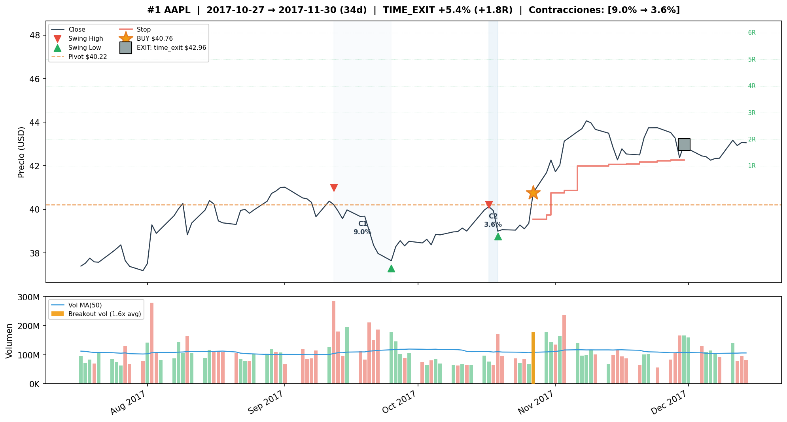
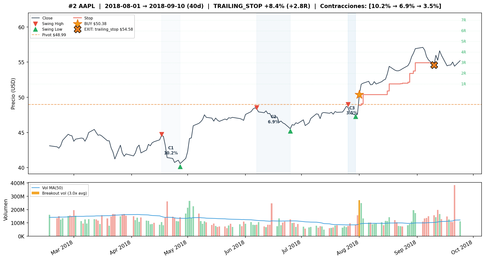
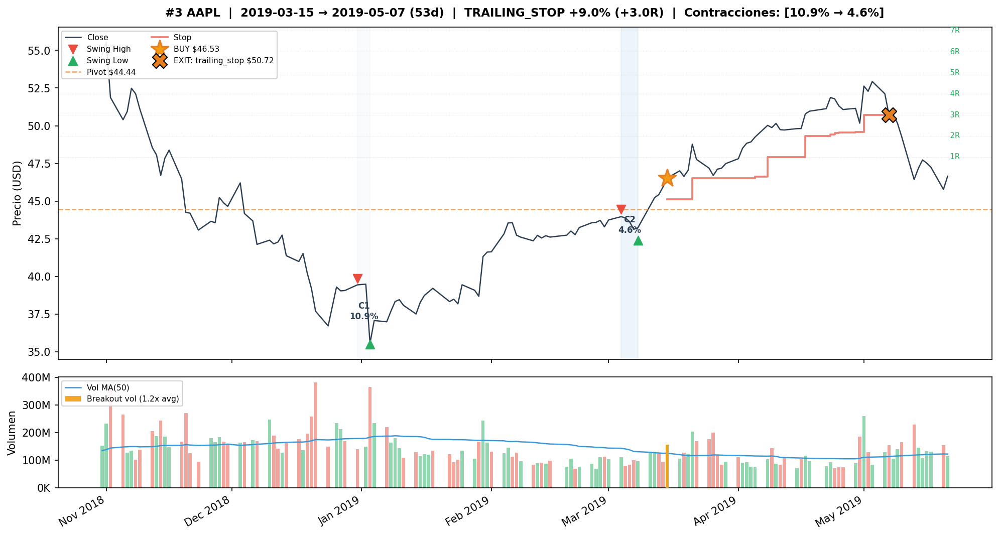
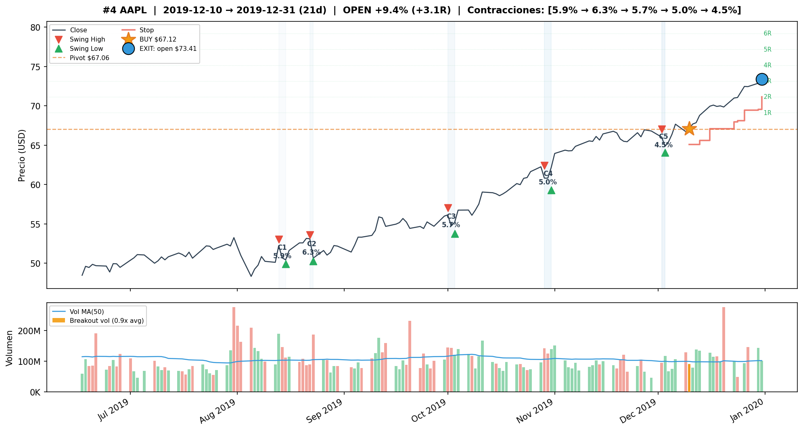
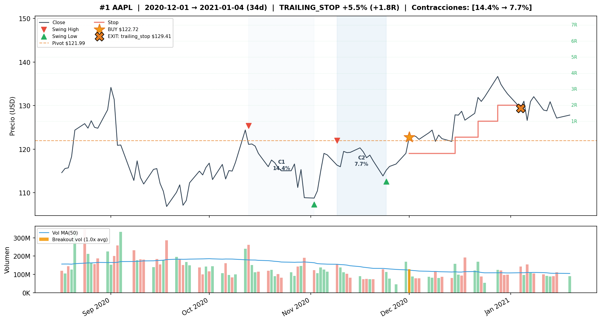
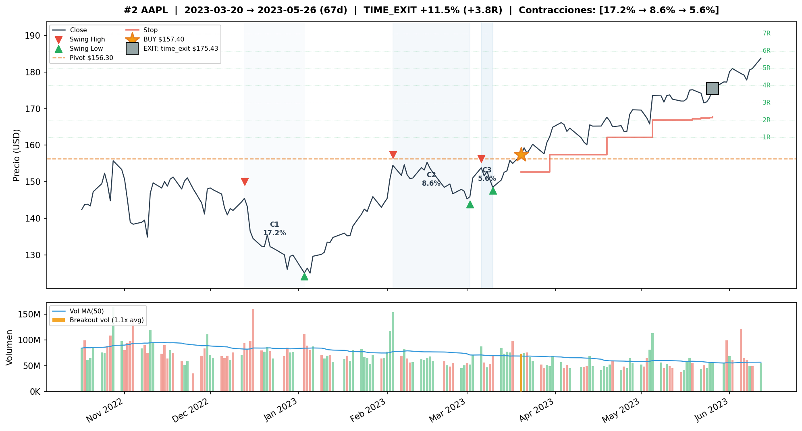
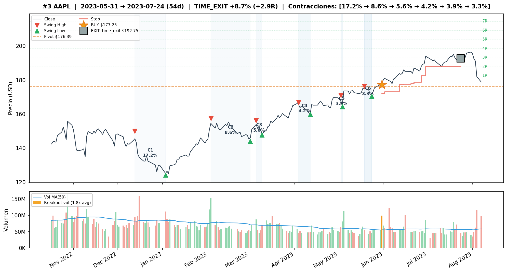
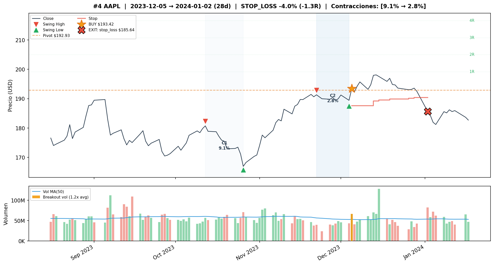
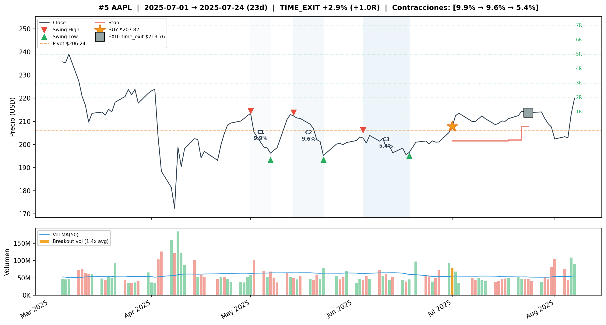
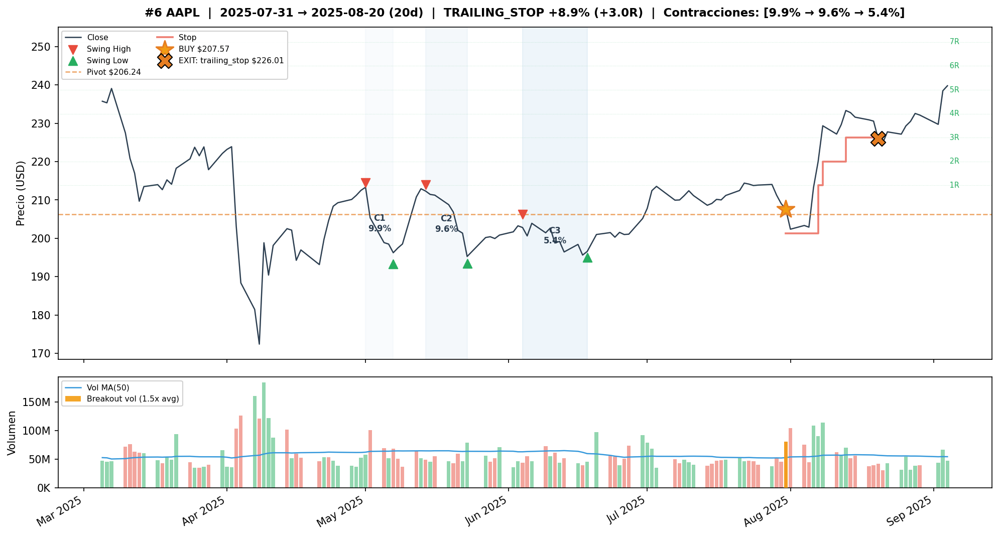

# AAPL — Forward Volume Confirmation v3

## Objetivo

Evaluar si permitir confirmacion de volumen en los N dias posteriores al breakout de precio mejora la robustez de las senales VCP para AAPL, comparado con las configs backward-only de v2.

**Train:** 2015-01-02 a 2019-12-31 (1,258 barras) | **Test:** 2020-01-02 a 2026-04-08 (1,574 barras)
**B&H Train:** CR=+168.59%, MaxDD=-38.73% | **B&H Test:** CR=+244.80%, MaxDD=-33.43%

---

## Metodologia

- Grid search completo (17,496 pipeline runs x 7 variantes de volumen por ticker)
- Variantes forward: `w{1,3}_t{1.2,1.5}_f{3,5}` (backward window x threshold x forward days)
- Post-filter: pipeline corre sin volume confirmation, filtro aplicado post-hoc
- Forward: si volumen no confirma backward, busca en N dias siguientes. Si precio se mantiene sobre pivot Y volumen confirma, entra a precio de cierre del dia de confirmacion (sin look-ahead bias)
- Ranking compuesto: 50% CR + 30% WR + 20% avg_R

---

## Deteccion base

Todas las variantes forward comparten la misma base de deteccion (heredada de v2):

```
atr_mult=2.0, use_close_only=False (HL)
max_depth_atr=6, min_total_reduction=0.80, lookback_bars=126
compression_threshold=0.85, tolerance=0.10
max_depth_pct=0.25, ascending_lows_tolerance=0.01
trend_template=False, volume_contraction=True (ratio<=0.85)
```

---

## Tabla comparativa — Train (2015-2019)

| Variante | T | W | L | WR | CR | MaxDD | Sharpe | avgR | PF |
|---|---|---|---|---|---|---|---|---|---|
| **Buy & Hold AAPL** | — | — | — | — | +168.59% | -38.73% | — | — | — |
| **FWD#1** w3_t1.2_f5 tr=3.0 be=1.0 sl=3% | 4 | 4 | 0 | 100% | +36.14% | 0.00% | 4.60 | +2.68 | inf |
| **FWD#2** w3_t1.2_f3 tr=3.0 be=1.0 sl=3% | 4 | 4 | 0 | 100% | +36.14% | 0.00% | 4.60 | +2.68 | inf |
| **FWD#3** w1_t1.2_f5 tr=3.0 be=1.0 sl=3% | 4 | 4 | 0 | 100% | +34.65% | 0.00% | 5.01 | +2.58 | inf |
| **Baseline** no_filter tr=3.0 be=2.0 sl=3% | 4 | 4 | 0 | 100% | +41.22% | 0.00% | 3.29 | +3.01 | inf |
| **Baseline** no_filter tr=3.0 be=1.0 sl=3% | 5 | 5 | 0 | 100% | +46.80% | 0.00% | 3.26 | +2.67 | inf |

---

## Tabla comparativa — Test (2020-2026)

| Variante | T | W | L | WR | CR | MaxDD | Sharpe | avgR | PF |
|---|---|---|---|---|---|---|---|---|---|
| **Buy & Hold AAPL** | — | — | — | — | +244.80% | -33.43% | — | — | — |
| **FWD#1** w3_t1.2_f5 tr=3.0 be=1.0 sl=3% | 6 | 5 | 1 | 83% | **+37.38%** | -4.02% | **1.07** | +1.85 | **9.3** |
| **FWD#2** w3_t1.2_f3 tr=3.0 be=1.0 sl=3% | 6 | 5 | 1 | 83% | **+37.38%** | -4.02% | **1.07** | +1.85 | **9.3** |
| **FWD#3** w1_t1.2_f5 tr=3.0 be=1.0 sl=3% | 6 | 5 | 1 | 83% | +19.56% | -4.02% | 0.67 | +1.04 | 5.7 |
| **Baseline** no_filter tr=3.0 be=2.0 sl=3% | 6 | 4 | 2 | 67% | +16.76% | -6.59% | 0.45 | +0.93 | 2.8 |
| **Baseline** no_filter tr=3.0 be=1.0 sl=3% | 6 | 4 | 2 | 67% | +19.36% | -6.59% | 0.50 | +1.06 | 3.0 |

---

## Configuracion ganadora — FWD#1 w3_t1.2_f5

**Deteccion:**
```
atr_mult=2.0, use_close_only=False (HL)
max_depth_atr=6, min_total_reduction=0.80, lookback_bars=126
compression_threshold=0.85, tolerance=0.10
max_depth_pct=0.25, ascending_lows_tolerance=0.01
trend_template=False, volume_contraction=True (ratio<=0.85)
vol_filter=w3_t1.2_f5 (backward 3 dias, threshold 1.2x, forward 5 dias)
```

**Salida:**
```
trailing_atr_multiplier=3.0, target_r_multiple=None
early_exit_days=None, breakeven_r_multiple=1.0, max_stop_loss_pct=0.03
max_bars_without_progress=15, min_progress_r=0.5
```

---

## Detalle de trades — FWD#1 Train (4T, 100% WR, +36.14%)

| # | Entry | Exit | Salida | PnL | R | MaxR | Dur |
|---|---|---|---|---|---|---|---|
| 1 | 2017-10-27 | 2017-11-30 | time_exit | +5.40% | +1.8R | 2.7R | 34d |
| 2 | 2018-08-01 | 2018-09-10 | trailing_stop | +8.35% | +2.8R | 4.4R | 40d |
| 3 | 2019-03-15 | 2019-05-07 | trailing_stop | +8.99% | +3.0R | 4.6R | 53d |
| 4 | 2019-12-10 | 2019-12-31 | open | +9.37% | +3.1R | 3.1R | 21d |

Graficos de los trades en TRAIN: `plots/aapl/train/`






## Detalle de trades — FWD#1 Test (6T, 83% WR, +37.38%)

| # | Entry | Exit | Salida | PnL | R | MaxR | Dur |
|---|---|---|---|---|---|---|---|
| 1 | 2020-12-01 | 2021-01-04 | trailing_stop | +5.45% | +1.8R | 3.8R | 34d |
| 2 | 2023-03-20 | 2023-05-26 | time_exit | +11.45% | +3.8R | 3.8R | 67d |
| 3 | 2023-05-31 | 2023-07-24 | time_exit | +8.74% | +2.9R | 3.4R | 54d |
| 4 | 2023-12-05 | 2024-01-02 | stop_loss | -4.02% | -1.3R | 0.8R | 28d |
| 5 | 2025-07-01 | 2025-07-24 | time_exit | +2.86% | +1.0R | 1.1R | 23d |
| 6 | 2025-07-31 | 2025-08-20 | trailing_stop | +8.88% | +3.0R | 4.1R | 20d |

Graficos de los trades en TEST: `plots/aapl/test/`








---

## Comparacion Train vs Test

| Metrica | FWD#1 Train | FWD#1 Test | Baseline (be=1.0) Train | Baseline (be=1.0) Test |
|---|---|---|---|---|
| Trades | 4 | 6 | 5 | 6 |
| WR | 100% | 83% | 100% | 67% |
| CR | +36.14% | **+37.38%** | +46.80% | +19.36% |
| MaxDD | 0.00% | -4.02% | 0.00% | -6.59% |
| Sharpe | 4.60 | 1.07 | 3.26 | 0.50 |
| avgR | +2.68 | +1.85 | +2.67 | +1.06 |
| PF | inf | 9.3 | inf | 3.0 |

---

## Observaciones

1. **FWD#1/2 (+37.38%) duplican el retorno del mejor baseline (+19.36%) en test.** WR sube de 67% a 83% con forward.

2. **El forward evito el trade toxico del 2025-07-25**: el baseline entra directamente y sufre stop_loss -5.38%. El forward no confirma volumen ese dia, y en cambio entra el 2025-07-31 con confirmacion, capturando +8.88%.

3. **FWD#1 y FWD#2 producen senales identicas** — el forward 3 vs 5 dias no importa para AAPL. Recomendacion: usar f5 para mayor flexibilidad sin costo.

4. **FWD#3 (w1) captura las mismas senales** pero con entries ligeramente diferentes y menor CR en test (+19.56% vs +37.38%).

5. **Mejor transicion train->test de todo el proyecto:** CR mejora de train a test (+36% -> +37%). Esto es notable porque normalmente hay degradacion significativa.

6. **Todos los trades en train son ganadores** (100% WR) para todas las variantes forward. En test, solo 1 loss (-4.02%) de 6 trades.

7. **Sharpe 1.07 en test** con Sharpe de B&H de ~0.79 en el mismo periodo. La estrategia VCP con forward supera al B&H en riesgo-retorno ajustado, no en retorno absoluto.

---

## Conclusion

**Forward volume confirmation es claramente beneficioso para AAPL.** La config recomendada es FWD#1 (w3_t1.2_f5, tr=3.0, be=1.0, sl=3%):

- Duplica el retorno del baseline en test (+37% vs +19%)
- WR de 83% en test (5 de 6 trades ganadores)
- MaxDD controlado (-4.02% vs -6.59% del baseline)
- Sharpe 1.07 vs 0.50 del baseline
- Evita el trade toxico de jul-2025 y lo reemplaza por un ganador via forward confirmation

El mecanismo funciona porque AAPL tiene breakouts "lentos" donde el volumen tarda 1-3 dias en confirmar. El forward captura estos breakouts validos que el filtro backward descartaria.
