# AMZN — Forward Volume Confirmation v3

## Objetivo

Evaluar si permitir confirmacion de volumen en los N dias posteriores al breakout de precio mejora la robustez de las senales VCP para AMZN, comparado con las configs backward-only de v2.

**Train:** 2015-01-02 a 2019-12-31 (1,258 barras) | **Test:** 2020-01-02 a 2026-04-08 (1,574 barras)
**B&H Train:** CR=+498.94%, MaxDD=-34.10% | **B&H Test:** CR=+133.14%, MaxDD=-56.15%

---

## Metodologia

- Grid search completo (17,496 pipeline runs x 7 variantes de volumen)
- Variantes forward: `w{1,3}_t{1.2,1.5}_f{3,5}` (backward window x threshold x forward days)
- Post-filter: pipeline corre sin volume confirmation, filtro aplicado post-hoc
- Forward: si volumen no confirma backward, busca en N dias siguientes. Si precio se mantiene sobre pivot Y volumen confirma, entra a precio de cierre del dia de confirmacion
- Ranking compuesto: 50% CR + 30% WR + 20% avg_R

---

## Deteccion base

**Forward (y baseline same det):**
```
atr_mult=3.0, use_close_only=False (HL)
max_depth_atr=None, min_total_reduction=0.60, lookback_bars=126
compression_threshold=0.90, tolerance=0.15
max_depth_pct=0.30, ascending_lows_tolerance=0.01
trend_template=False, volume_contraction=True (ratio<=0.85)
```

**Baseline best NF (deteccion distinta):**
```
atr_mult=2.0, use_close_only=True (Close)
max_depth_atr=8, min_total_reduction=0.80, lookback_bars=126
compression_threshold=0.95, tolerance=0.10
max_depth_pct=0.30, ascending_lows_tolerance=0.03
trend_template=False, volume_contraction=False
```

---

## Tabla comparativa — Train (2015-2019)

| Variante | T | W | L | WR | CR | MaxDD | Sharpe | avgR | PF |
|---|---|---|---|---|---|---|---|---|---|
| **Buy & Hold AMZN** | — | — | — | — | +498.94% | -34.10% | — | — | — |
| **FWD#1** w3_t1.2_f3 tr=2.0 be=1.5 sl=3% VC | 12 | 9 | 3 | 75% | +111.12% | -1.80% | 1.57 | +2.21 | 26.1 |
| **FWD#2** w3_t1.2_f3 tr=2.5 tg=3R sl=3% VC | 14 | 9 | 5 | 64% | +84.27% | -5.42% | 1.34 | +1.54 | 6.4 |
| **Baseline NF** (best NF det) tr=2.0 be=1.5 sl=3% | 19 | 12 | 7 | 63% | +113.58% | -6.29% | 1.17 | +1.44 | 4.8 |
| **Baseline NF** (same det) tr=2.0 be=1.5 sl=3% | 14 | 9 | 5 | 64% | +93.22% | -7.53% | 1.15 | +1.69 | 6.3 |

---

## Tabla comparativa — Test (2020-2026)

| Variante | T | W | L | WR | CR | MaxDD | Sharpe | avgR | PF |
|---|---|---|---|---|---|---|---|---|---|
| **Buy & Hold AMZN** | — | — | — | — | +133.14% | -56.15% | — | — | — |
| **FWD#1** w3_t1.2_f3 tr=2.0 be=1.5 sl=3% VC | **0** | — | — | — | — | — | — | — | — |
| **FWD#2** w3_t1.2_f3 tr=2.5 tg=3R sl=3% VC | **0** | — | — | — | — | — | — | — | — |
| **Baseline NF** (best NF det) tr=2.0 be=1.5 sl=3% | 14 | 5 | 9 | 36% | **-0.12%** | -13.17% | 0.04 | +0.06 | 1.1 |
| **Baseline NF** (same det) tr=2.0 be=1.5 sl=3% | **0** | — | — | — | — | — | — | — | — |

---

## Detalle de trades — FWD#1 Train (12T, 75% WR, +111.12%)

| # | Entry | Exit | Salida | PnL | R | MaxR | Dur |
|---|---|---|---|---|---|---|---|
| 1 | 2016-04-29 | 2016-06-23 | time_exit | +9.47% | +3.2R | 3.5R | 55d |
| 2 | 2016-06-24 | 2016-09-01 | time_exit | +10.25% | +3.4R | 3.5R | 69d |
| 3 | 2017-03-29 | 2017-04-13 | trailing_stop | +1.18% | +0.4R | 1.3R | 15d |
| 4 | 2017-04-27 | 2017-06-09 | trailing_stop | +6.53% | +2.2R | 3.4R | 43d |
| 5 | 2017-10-12 | 2017-10-20 | stop_loss | -1.80% | -0.6R | 0.3R | 8d |
| 6 | 2017-10-27 | 2017-12-04 | trailing_stop | +3.00% | +1.0R | 2.9R | 38d |
| 7 | 2017-12-05 | 2018-02-01 | trailing_stop | +21.76% | +7.3R | 9.0R | 58d |
| 8 | 2018-07-12 | 2018-07-30 | trailing_stop | -0.97% | -0.3R | 1.2R | 18d |
| 9 | 2018-07-31 | 2018-09-06 | trailing_stop | +10.18% | +3.4R | 4.9R | 37d |
| 10 | 2019-03-18 | 2019-05-10 | trailing_stop | +8.49% | +2.8R | 4.2R | 53d |
| 11 | 2019-05-13 | 2019-05-23 | trailing_stop | -0.40% | -0.1R | 1.6R | 10d |
| 12 | 2019-06-05 | 2019-07-26 | trailing_stop | +11.77% | +3.9R | 5.4R | 51d |

Graficos de los trades en TRAIN: `plots/amzn/train/`

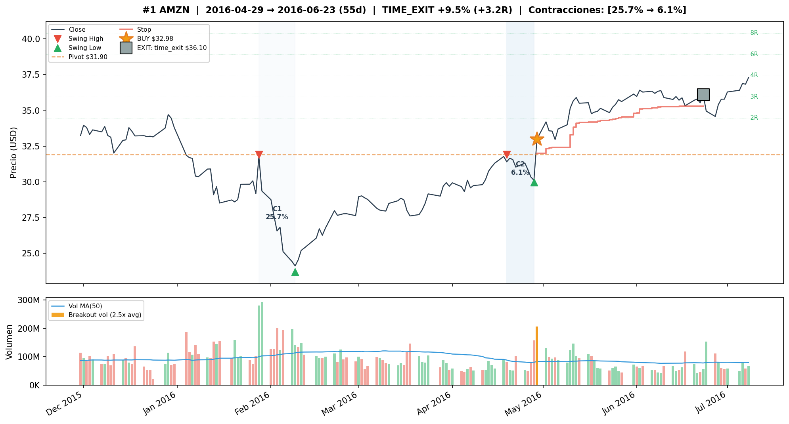
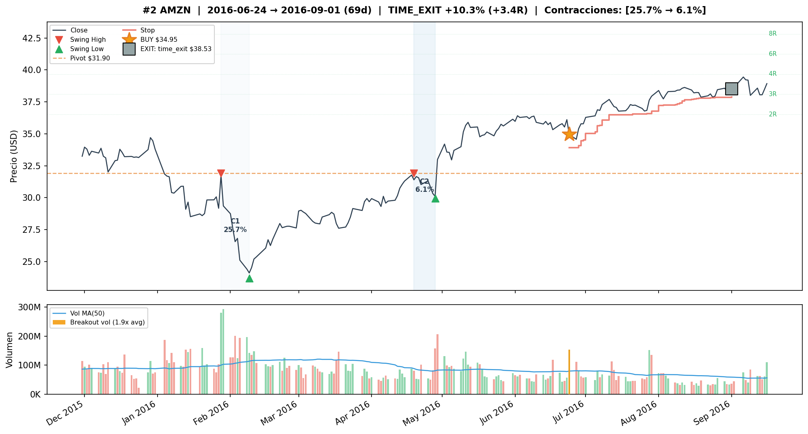
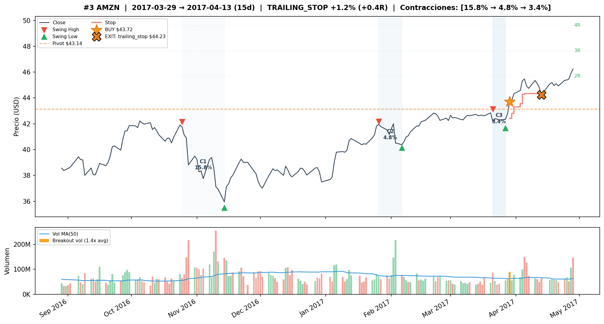
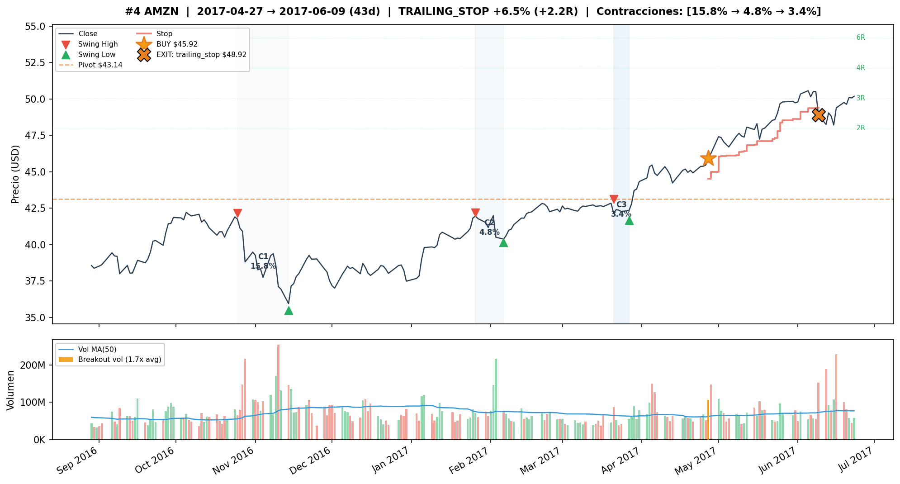
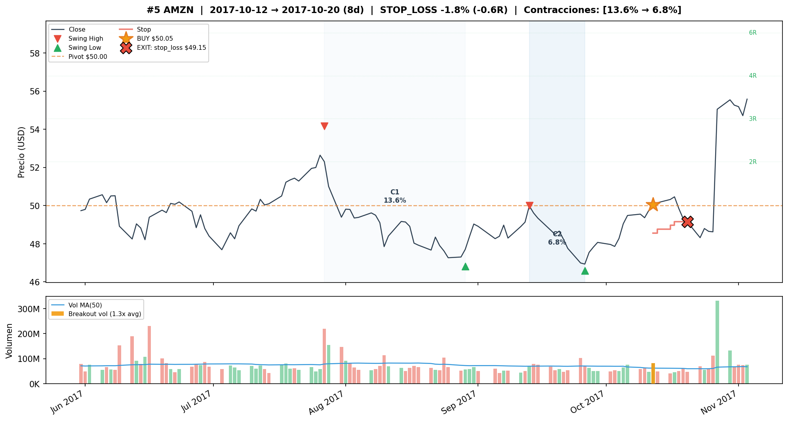
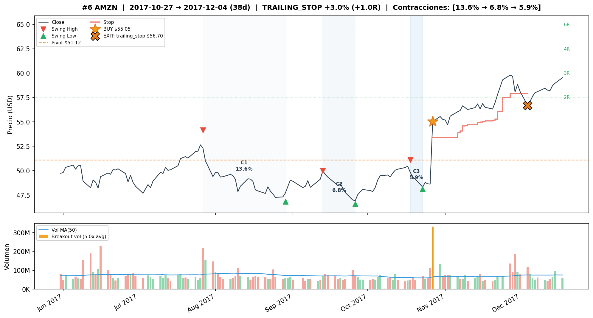
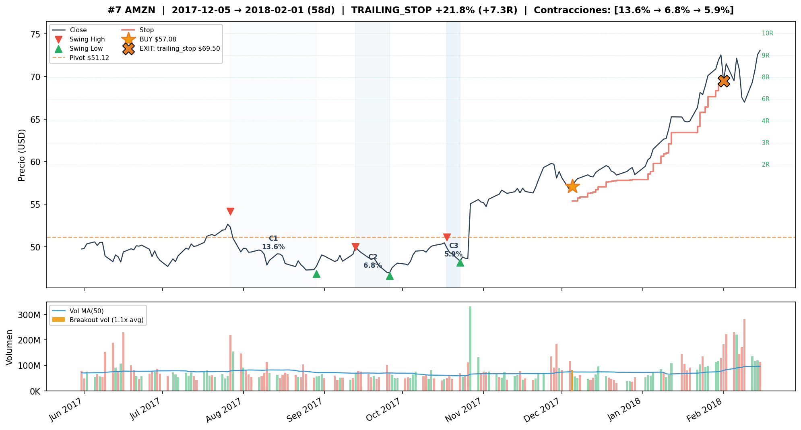
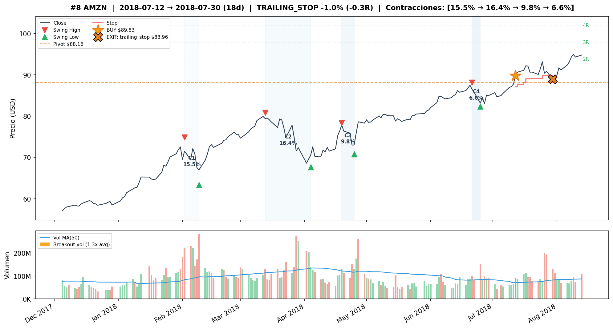
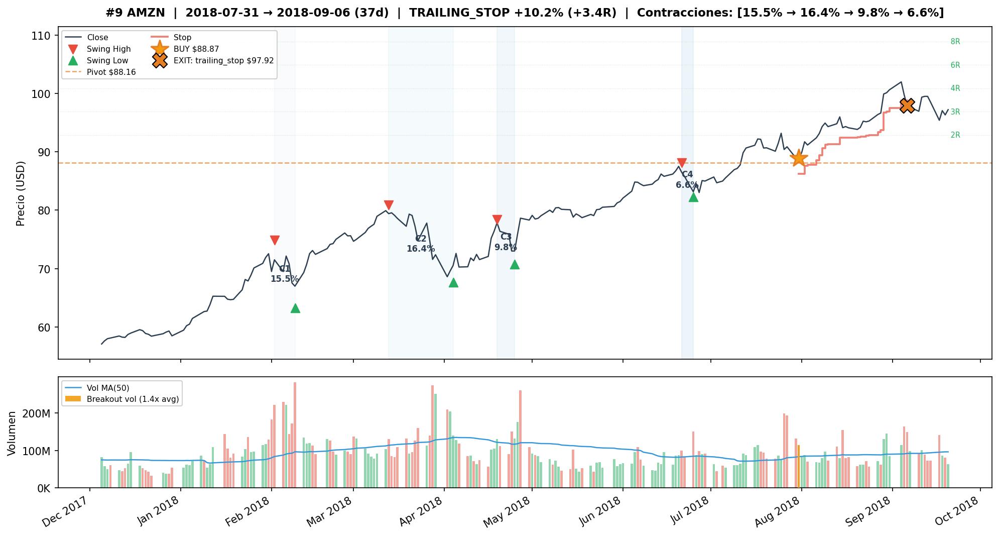
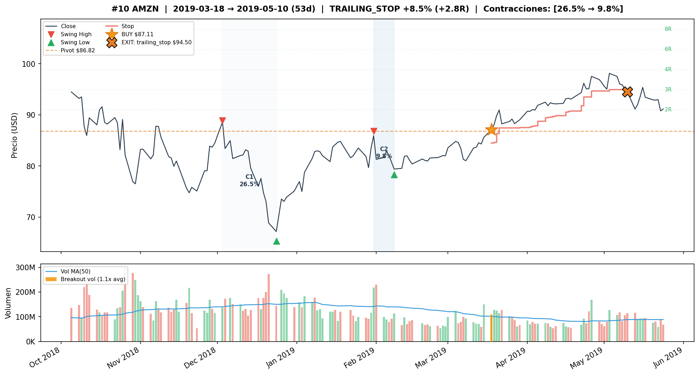
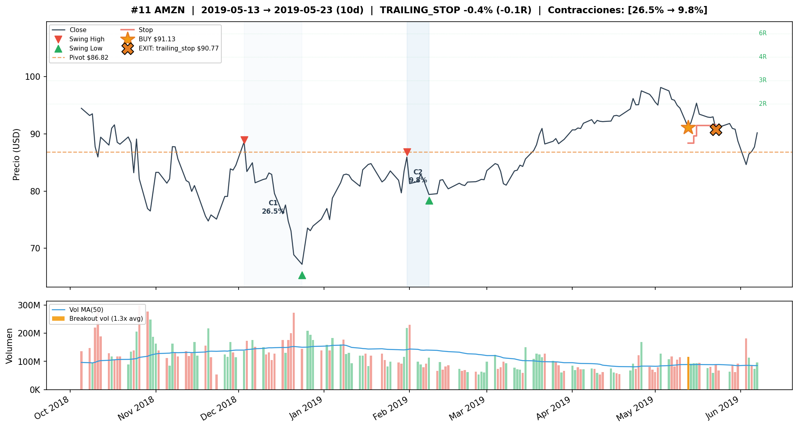
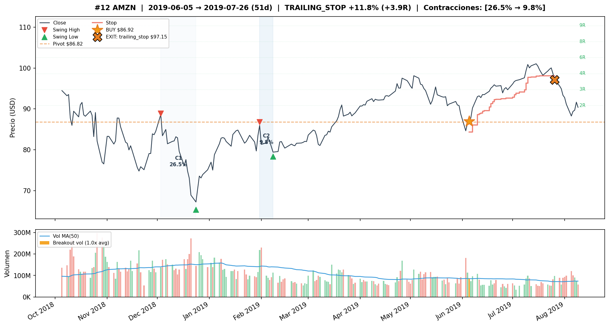

## Test — 0 trades

**0 trades en test** para TODA configuracion con los params de deteccion que ganan en train (atr=3.0, VC=True).

### Diagnostico: por que 0 senales en test

El pipeline detecta 8 secuencias de contracciones decrecientes validas en test, pero **ninguna pasa simultaneamente ATR compression Y volume contraction**:

| Secuencia | ATR ratio (req ≤0.90) | Vol ratio (req ≤0.85) | ATR | VC |
|---|---|---|---|---|
| 2020-03 → 2020-05 | 1.091 | 0.577 | FAIL | OK |
| 2020-03 → 2020-06 | 1.195 | 0.749 | FAIL | OK |
| 2020-09 → 2020-11 | 1.460 | 1.020 | FAIL | FAIL |
| 2021-07 → 2021-10 | 1.041 | 1.799 | FAIL | FAIL |
| 2023-02 → 2023-07 | 0.788 | 0.911 | OK | FAIL |
| 2023-09 → 2024-01 | 0.916 | 0.705 | FAIL | OK |
| 2024-07 → 2024-10 | 1.066 | 0.747 | FAIL | OK |
| 2025-11 → 2026-01 | 0.738 | 0.856 | OK | FAIL |

- **4 pasan VC pero no ATR** — la volatilidad *aumenta* durante la consolidacion (ATR ratio > 1.0 en 3 de 4 casos)
- **2 pasan ATR pero no VC** — el volumen no se contrae lo suficiente (ratios 0.856 y 0.911, justo arriba del threshold 0.85)
- **2 no pasan ninguno**
- **0 pasan ambos**

El patron clasico VCP requiere que volatilidad y volumen se compriman simultaneamente. En AMZN post-2020, las consolidaciones tienen una u otra caracteristica, pero nunca las dos juntas.

---

## Comparacion Train vs Test

| Metrica | FWD#1 Train | FWD#1 Test | Baseline NF (best) Train | Baseline NF (best) Test |
|---|---|---|---|---|
| Trades | 12 | **0** | 19 | 14 |
| WR | 75% | — | 63% | 36% |
| CR | +111.12% | — | +113.58% | **-0.12%** |
| MaxDD | -1.80% | — | -6.29% | -13.17% |

---

## Observaciones

1. **0 trades en test para TODA configuracion con los params ganadores de train** (atr=3.0, VC=True). El problema no es el forward sino la deteccion base: ATR compression y volume contraction nunca se cumplen simultaneamente en AMZN post-2020.

2. **Las 8 secuencias de contracciones decrecientes validas en test fallan por la interseccion de filtros**: 4 pasan VC pero no ATR (la volatilidad aumenta en vez de comprimirse), 2 pasan ATR pero no VC (el volumen no baja lo suficiente, ratios 0.856 y 0.911 justo arriba del threshold), y 2 no pasan ninguno. El patron VCP clasico — donde volatilidad y volumen se comprimen juntos — no se da en AMZN post-2020.

3. **Unico baseline con trades en test** usa params distintos (atr=2.0, close=True, VC=False) y es negativo (-0.12%, 36% WR, 14 trades). Produccion alta pero calidad baja.

4. **AMZN cambio de regimen despues de 2020**: COVID crash → recovery → caida 2022 (-55%) → tariffs 2025 generan consolidaciones donde la volatilidad no decrece (ATR ratio > 1.0 en la mayoria de las secuencias). Las consolidaciones de AMZN ya no se comportan como VCPs clasicos.

5. **Train es excelente para forward**: +111.12% CR, 75% WR, MaxDD -1.80%, Sharpe 1.57. La config FWD#1 es la segunda mejor en train de todo el universo de 5 tickers. Esto subraya el riesgo de sobre-ajuste temporal.

6. **atr_mult=3.0 es unico de AMZN** — necesario para capturar los swings de mayor amplitud del activo en 2015-2019. Pero esto hace la deteccion demasiado restrictiva para el regimen post-2020.

---

## Conclusion

**AMZN no es viable para la estrategia VCP** con los parametros actuales del grid. El problema es estructural:

- Los params de deteccion que funcionan en train (2015-2019) no producen NINGUNA senal en test (2020-2026)
- Hay 8 secuencias de contracciones validas en test, pero ATR compression y volume contraction nunca coinciden: cuando el volumen baja la volatilidad sube, y viceversa
- El forward volume confirmation no puede resolver un problema de deteccion base
- El unico baseline con trades en test es negativo (-0.12%)

Posibles direcciones:
- Evaluar un grid mas amplio de atr_mult (1.5, 1.0) para capturar swings de menor escala
- Usar splits temporales rodantes (walk-forward) en vez de un split fijo
- Considerar excluir AMZN del universo VCP
