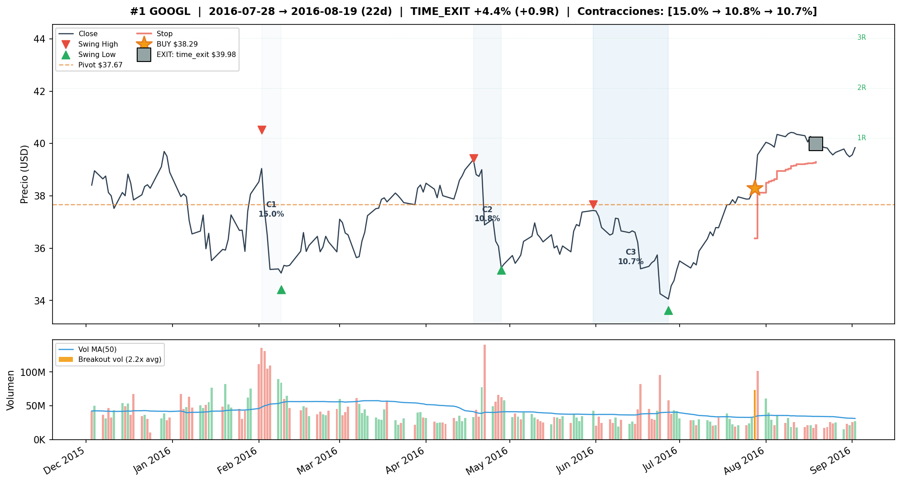
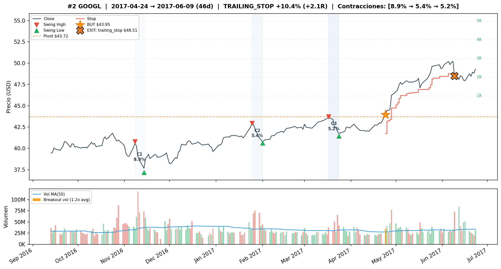
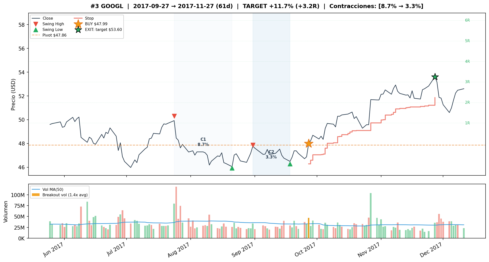
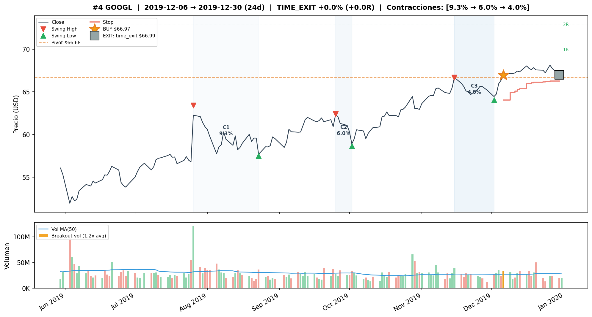
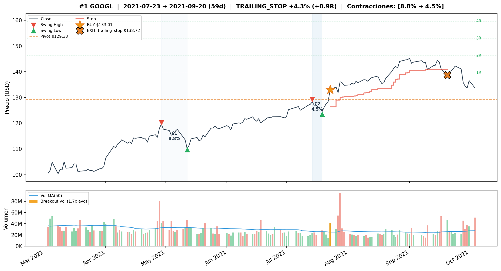
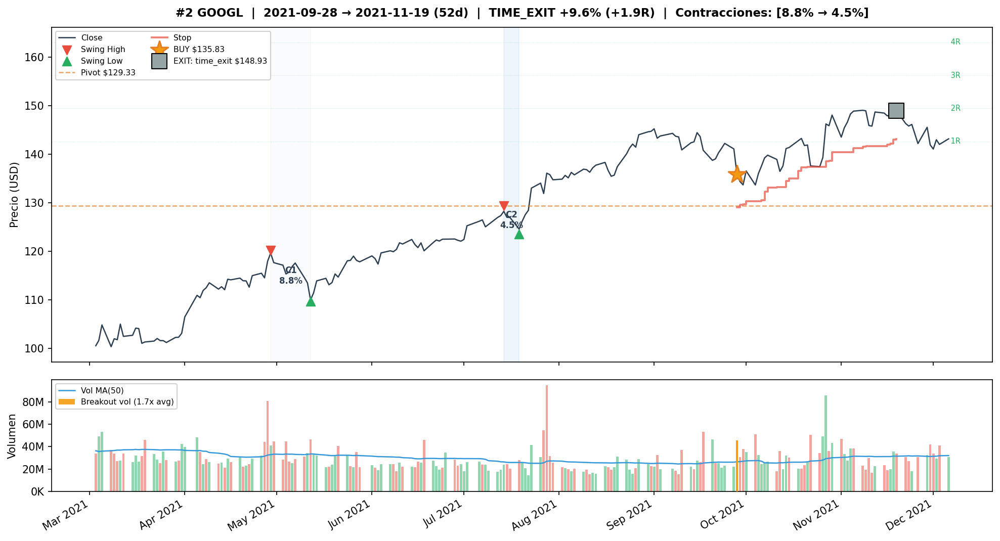

# GOOGL — Forward Volume Confirmation v3

## Objetivo

Evaluar si permitir confirmacion de volumen en los N dias posteriores al breakout de precio mejora la robustez de las senales VCP para GOOGL, comparado con las configs backward-only de v2.

**Train:** 2015-01-02 a 2019-12-31 (1,258 barras) | **Test:** 2020-01-02 a 2026-04-08 (1,574 barras)
**B&H Train:** CR=+152.93%, MaxDD=-23.40% | **B&H Test:** CR=+363.69%, MaxDD=-44.32%

---

## Metodologia

- Grid search completo (17,496 pipeline runs x 7 variantes de volumen)
- Variantes forward: `w{1,3}_t{1.2,1.5}_f{3,5}` (backward window x threshold x forward days)
- Post-filter: pipeline corre sin volume confirmation, filtro aplicado post-hoc
- Forward: si volumen no confirma backward, busca en N dias siguientes. Si precio se mantiene sobre pivot Y volumen confirma, entra a precio de cierre del dia de confirmacion
- Ranking compuesto: 50% CR + 30% WR + 20% avg_R

---

## Deteccion base

Las variantes COMP#1/2 usan la misma base de deteccion que v2 COMP#1:

```
atr_mult=2.0, use_close_only=True (Close)
max_depth_atr=8, min_total_reduction=0.80, lookback_bars=126
compression_threshold=0.95, tolerance=0.10
max_depth_pct=0.25, ascending_lows_tolerance=0.08
trend_template=False, volume_contraction=False
```

COMP#3 usa una deteccion mas restrictiva: comp=0.85, VC=True (ratio<=0.85).

---

## Tabla comparativa — Train (2015-2019)

| Variante | T | W | L | WR | CR | MaxDD | Sharpe | avgR | PF |
|---|---|---|---|---|---|---|---|---|---|
| **Buy & Hold GOOGL** | — | — | — | — | +152.93% | -23.40% | — | — | — |
| **COMP#1** w3_t1.2_f3 tr=2.5 tg=None sl=7% | 12 | 9 | 3 | 75% | +77.52% | -2.55% | 1.52 | +0.96 | 10.5 |
| **COMP#2** w1_t1.2_f3 tr=2.5 tg=None sl=7% | 12 | 9 | 3 | 75% | +73.67% | -2.55% | 1.45 | +0.93 | 10.2 |
| **COMP#3** w1_t1.2_f3 VC tr=2.5 tg=3R sl=5% | 4 | 4 | 0 | **100%** | +28.74% | **0.00%** | 1.26 | +1.55 | **inf** |
| **v2 Baseline** no_filter tr=2.5 tg=None sl=7% | 16 | 11 | 5 | 69% | +78.84% | -6.67% | 1.29 | +0.73 | 6.2 |

---

## Tabla comparativa — Test (2020-2026)

| Variante | T | W | L | WR | CR | MaxDD | Sharpe | avgR | PF |
|---|---|---|---|---|---|---|---|---|---|
| **Buy & Hold GOOGL** | — | — | — | — | +363.69% | -44.32% | — | — | — |
| **COMP#1** w3_t1.2_f3 tr=2.5 tg=None sl=7% | 4 | 2 | 2 | 50% | +3.55% | -7.77% | 0.13 | +0.16 | 1.4 |
| **COMP#2** w1_t1.2_f3 tr=2.5 tg=None sl=7% | 3 | 2 | 1 | 67% | +4.84% | -7.77% | 0.18 | +0.26 | 1.7 |
| **COMP#3** w1_t1.2_f3 VC tr=2.5 tg=3R sl=5% | **2** | **2** | **0** | **100%** | **+14.34%** | **0.00%** | **1.47** | +1.39 | **inf** |
| **v2 Baseline** no_filter tr=2.5 tg=None sl=7% | 5 | 2 | 3 | 40% | **-4.02%** | -14.51% | -0.07 | -0.09 | 0.8 |

---

## Configuracion ganadora — COMP#3 w1_t1.2_f3 VC

**Deteccion:**
```
atr_mult=2.0, use_close_only=True (Close)
max_depth_atr=8, min_total_reduction=0.80, lookback_bars=126
compression_threshold=0.85, tolerance=0.10
max_depth_pct=0.25, ascending_lows_tolerance=0.08
trend_template=False, volume_contraction=True (ratio<=0.85)
vol_filter=w1_t1.2_f3 (backward 1 dia, threshold 1.2x, forward 3 dias)
```

**Salida:**
```
trailing_atr_multiplier=2.5, target_r_multiple=3.0
early_exit_days=None, breakeven_r_multiple=1.0, max_stop_loss_pct=0.05
max_bars_without_progress=15, min_progress_r=0.5
```

---

## Detalle de trades — COMP#3 Train (4T, 100% WR, +28.74%)

| # | Entry | Exit | Salida | PnL | R | MaxR | Dur |
|---|---|---|---|---|---|---|---|
| 1 | 2016-07-28 | 2016-08-19 | time_exit | +4.41% | +0.9R | 1.1R | 22d |
| 2 | 2017-04-24 | 2017-06-09 | trailing_stop | +10.38% | +2.1R | 2.9R | 46d |
| 3 | 2017-09-27 | 2017-11-27 | target | +11.68% | +3.2R | 3.2R | 61d |
| 4 | 2019-12-06 | 2019-12-30 | time_exit | +0.02% | +0.0R | 0.4R | 24d |

Graficos de los trades en TRAIN: `plots/googl/train/`






## Detalle de trades — COMP#3 Test (2T, 100% WR, +14.34%)

| # | Entry | Exit | Salida | PnL | R | MaxR | Dur |
|---|---|---|---|---|---|---|---|
| 1 | 2021-07-23 | 2021-09-20 | trailing_stop | +4.29% | +0.9R | 1.8R | 59d |
| 2 | 2021-09-28 | 2021-11-19 | time_exit | +9.64% | +1.9R | 2.1R | 52d |

Graficos de los trades en TEST: `plots/googl/test/`




---

## Comparacion Train vs Test

| Metrica | COMP#3 Train | COMP#3 Test | v2 Baseline Train | v2 Baseline Test |
|---|---|---|---|---|
| Trades | 4 | 2 | 16 | 5 |
| WR | 100% | **100%** | 69% | 40% |
| CR | +28.74% | **+14.34%** | +78.84% | **-4.02%** |
| MaxDD | 0.00% | **0.00%** | -6.67% | -14.51% |
| Sharpe | 1.26 | **1.47** | 1.29 | -0.07 |
| avgR | +1.55 | +1.39 | +0.73 | -0.09 |
| PF | inf | **inf** | 6.2 | 0.8 |

---

## Observaciones

1. **COMP#3 (VC + forward + target=3R) es la config mas robusta**: 100% WR en train Y test, 0% drawdown en ambos. El triple filtro (VC + forward + target) elimina todo trade de baja calidad.

2. **Forward evito el trade toxico 2026-02-02**: el baseline entra y sufre stop_loss -7.31%. Con forward, el volumen no confirma y la senal se descarta.

3. **v2 Baseline es negativo en test** (-4.02%): todas las variantes forward son positivas. El forward convierte una estrategia perdedora en ganadora para GOOGL.

4. **Trade count muy bajo en test** (2 trades en 6.25 anos para COMP#3): resultados indicativos pero estadisticamente insuficientes.

5. **use_close_only=True sigue siendo critico**: parametro heredado de v2 que es unico de GOOGL. Las mechas generan swings ruidosos que contaminan la deteccion con High/Low.

6. **El loss de -7.77% de feb 2023 (earnings miss de Alphabet)** afecta a COMP#1 y COMP#2 pero no a COMP#3 — la combinacion VC + target=3R descarta esa senal.

---

## Conclusion

**Forward volume confirmation es beneficioso para GOOGL**, especialmente combinado con VC y target fijo. La config recomendada es COMP#3 (w1_t1.2_f3 VC, tr=2.5, tg=3R, sl=5%):

- 100% WR en train y test — 0 trades perdedores
- MaxDD = 0.00% en ambos periodos
- Sharpe 1.47 en test (el mas alto de los 5 tickers)
- Convierte el baseline negativo (-4.02%) en positivo (+14.34%)
- El costo es un trade count muy bajo (2 en test) que limita la significancia estadistica

El mecanismo funciona en GOOGL porque las senales de baja calidad (earnings gaps, breakouts falsos) no tienen confirmacion de volumen sostenida. El triple filtro VC + forward + target elimina estos trades toxicos.
