# META — Forward Volume Confirmation v3

## Objetivo

Evaluar si permitir confirmacion de volumen en los N dias posteriores al breakout de precio mejora la robustez de las senales VCP para META, comparado con las configs backward-only de v2.

**Train:** 2015-01-02 a 2019-12-31 (1,258 barras) | **Test:** 2020-01-02 a 2026-06-09 (1,617 barras)
**B&H Train:** CR=+161.63%, MaxDD=-42.96% | **B&H Test:** CR=+178.67%, MaxDD=-76.74%

---

## Metodologia

- Grid search completo (17,496 pipeline runs x 7 variantes de volumen)
- Variantes forward: `w{1,3}_t{1.2,1.5}_f{3,5}` (backward window x threshold x forward days)
- Post-filter: pipeline corre sin volume confirmation, filtro aplicado post-hoc
- Forward: si volumen no confirma backward, busca en N dias siguientes. Si precio se mantiene sobre pivot Y volumen confirma, entra a precio de cierre del dia de confirmacion
- Ranking compuesto: 50% CR + 30% WR + 20% avg_R

---

## Deteccion base

Tres bases de deteccion evaluadas:

**Baseline (ganador) y FWD#2:**
```
atr_mult=2.0, use_close_only=False (HL)
max_depth_atr=None, min_total_reduction=0.80, lookback_bars=126
compression_threshold=0.95, tolerance=0.10
max_depth_pct=0.25, ascending_lows_tolerance=0.01
trend_template=False, volume_contraction=True (ratio<=0.85)
```

**BW#1 (backward only, sin VC):**
```
atr_mult=2.0, use_close_only=False (HL)
max_depth_atr=None, min_total_reduction=0.60, lookback_bars=126
compression_threshold=0.95, tolerance=0.10
max_depth_pct=0.25, ascending_lows_tolerance=0.01
trend_template=False, volume_contraction=False
```

**FWD#1 (short lookback, sin VC):**
```
atr_mult=2.0, use_close_only=False (HL)
max_depth_atr=6, min_total_reduction=0.60, lookback_bars=63
compression_threshold=0.95, tolerance=0.10
max_depth_pct=0.25, ascending_lows_tolerance=0.01
trend_template=False, volume_contraction=False
```

**FWD#3 (tolerancia alta, sin VC):**
```
atr_mult=2.0, use_close_only=False (HL)
max_depth_atr=None, min_total_reduction=0.80, lookback_bars=63
compression_threshold=0.95, tolerance=0.20
max_depth_pct=0.25, ascending_lows_tolerance=0.03
trend_template=False, volume_contraction=False
```

---

## Tabla comparativa — Train (2015-2019)

| Variante | T | W | L | WR | CR | MaxDD | Sharpe | avgR | PF |
|---|---|---|---|---|---|---|---|---|---|
| **Buy & Hold META** | — | — | — | — | +161.63% | -42.96% | — | — | — |
| **Baseline** no_filter VC tr=1.5 tg=2R sl=3% | **14** | 11 | 3 | 79% | **+59.56%** | -2.81% | **1.45** | +1.16 | 8.4 |
| **BW#1** w1_t1.2 tr=2.5 tg=2R sl=7% | 7 | 6 | 1 | 86% | +45.23% | -1.12% | 1.18 | +0.98 | 36.2 |
| **FWD#1** w1_t1.2_f3 tr=2.5 tg=2R sl=7% | 5 | 5 | 0 | **100%** | +43.87% | **0.00%** | 1.43 | **+1.33** | **inf** |
| **FWD#2** w1_t1.2_f3 VC tr=2.5 tg=2R sl=7% | 6 | 5 | 1 | 83% | +44.03% | -1.12% | 1.24 | +1.11 | 35.4 |
| **FWD#3** w3_t1.5_f3 tr=3.0 tg=5R early=3 sl=5% | 8 | 6 | 2 | 75% | +50.29% | -1.79% | 0.82 | +1.11 | 21.9 |

---

## Tabla comparativa — Test (2020-2026)

| Variante | T | W | L | WR | CR | MaxDD | Sharpe | avgR | PF |
|---|---|---|---|---|---|---|---|---|---|
| **Buy & Hold META** | — | — | — | — | +178.67% | -76.74% | — | — | — |
| **Baseline** no_filter VC tr=1.5 tg=2R sl=3% | **27** | **15** | 12 | 56% | **+107.47%** | -15.09% | **0.96** | +0.98 | 3.3 |
| **BW#1** w1_t1.2 tr=2.5 tg=2R sl=7% | 12 | 8 | 4 | **67%** | +83.22% | -10.53% | 0.78 | +0.79 | **5.4** |
| **FWD#1** w1_t1.2_f3 tr=2.5 tg=2R sl=7% | 9 | 6 | 3 | **67%** | +67.55% | -16.31% | 0.67 | +0.92 | 4.4 |
| **FWD#2** w1_t1.2_f3 VC tr=2.5 tg=2R sl=7% | 11 | 7 | 4 | 64% | +78.27% | **-10.53%** | 0.75 | +0.83 | 5.2 |
| **FWD#3** w3_t1.5_f3 tr=3.0 tg=5R early=3 sl=5% | 11 | 5 | 6 | 45% | +52.85% | -8.54% | 0.47 | +0.93 | 4.3 |

---

## Configuracion destacada v3 — FWD#1 w1_t1.2_f3

**Deteccion:**
```
atr_mult=2.0, use_close_only=False (HL)
max_depth_atr=6, min_total_reduction=0.60, lookback_bars=63
compression_threshold=0.95, tolerance=0.10
max_depth_pct=0.25, ascending_lows_tolerance=0.01
trend_template=False, volume_contraction=False
vol_filter=w1_t1.2_f3 (backward 1 dia, threshold 1.2x, forward 3 dias)
```

**Salida:**
```
trailing_atr_multiplier=2.5, target_r_multiple=2.0
early_exit_days=None, breakeven_r_multiple=0.5, max_stop_loss_pct=0.07
max_bars_without_progress=15, min_progress_r=0.5
```

---

## Detalle de trades — FWD#1 Train (5T, 100% WR, +43.87%)

| # | Entry | Exit | Salida | PnL | R | MaxR | Dur |
|---|---|---|---|---|---|---|---|
| 1 | 2015-06-22 | 2015-07-15 | time_exit | +5.92% | +0.9R | 1.0R | 23d |
| 2 | 2016-04-28 | 2016-05-19 | time_exit | +0.07% | +0.0R | 0.5R | 21d |
| 3 | 2017-02-22 | 2017-04-20 | time_exit | +5.64% | +1.3R | 1.3R | 57d |
| 4 | 2018-04-26 | 2018-06-20 | target | +15.99% | +2.3R | 2.3R | 55d |
| 5 | 2018-06-25 | 2018-07-25 | target | +10.77% | +2.1R | 2.1R | 30d |

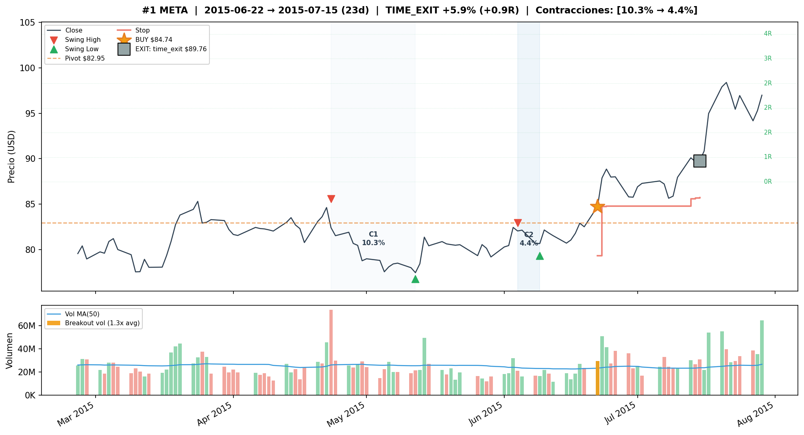
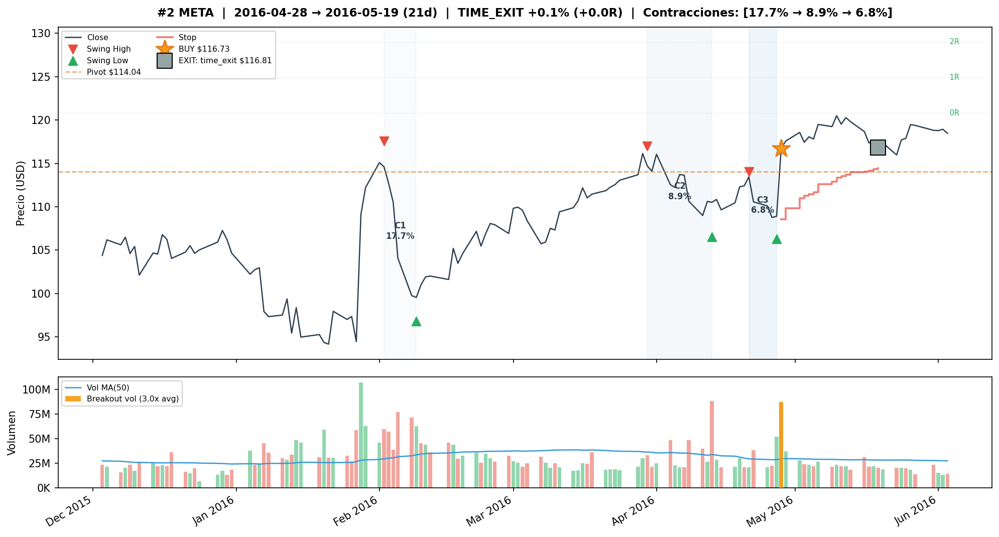
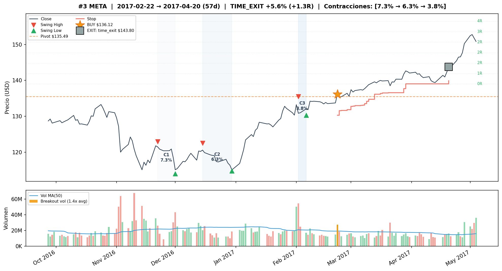
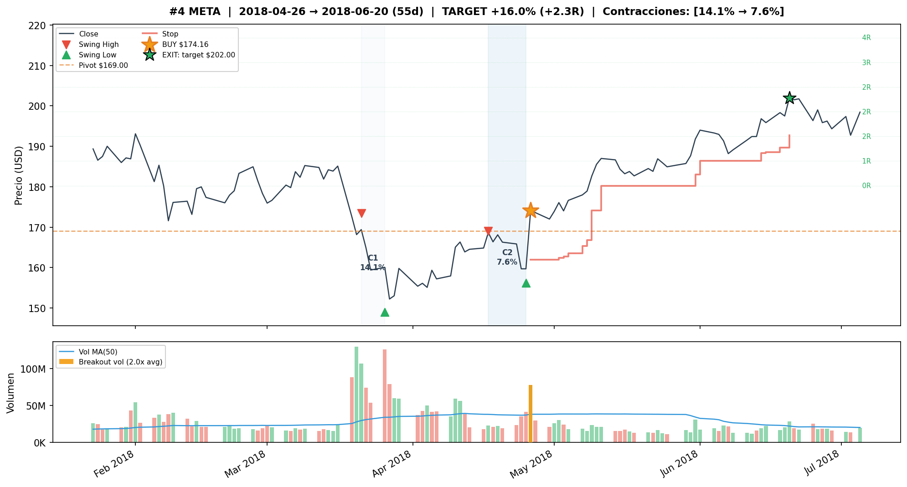
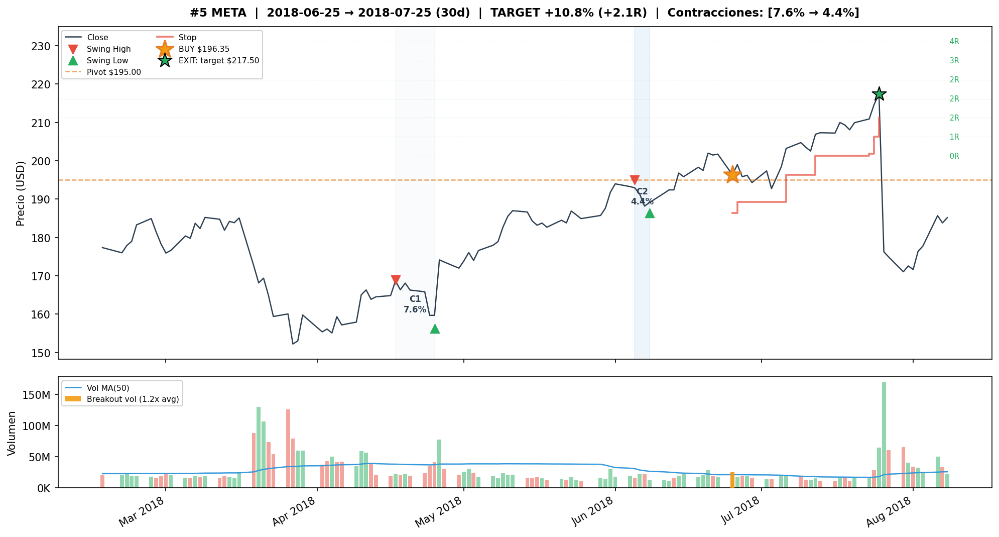

## Detalle de trades — FWD#1 Test (9T, 67% WR, +67.55%)

| # | Entry | Exit | Salida | PnL | R | MaxR | Dur |
|---|---|---|---|---|---|---|---|
| 1 | 2021-04-29 | 2021-05-10 | stop_loss | -7.14% | -1.0R | 0.0R | 11d |
| 2 | 2021-06-28 | 2021-07-19 | stop_loss | -5.26% | -0.8R | 0.0R | 21d |
| 3 | 2021-09-15 | 2021-09-20 | stop_loss | -4.87% | -0.8R | 0.0R | 5d |
| 4 | 2023-03-14 | 2023-04-14 | target | +14.16% | +2.0R | 2.0R | 31d |
| 5 | 2023-04-26 | 2023-04-28 | target | +14.77% | +2.1R | 2.1R | 2d |
| 6 | 2023-05-03 | 2023-06-01 | target | +15.01% | +2.1R | 2.1R | 29d |
| 7 | 2023-09-15 | 2023-10-20 | trailing_stop | +2.78% | +0.4R | 1.3R | 35d |
| 8 | 2024-01-10 | 2024-02-02 | target | +28.21% | +4.0R | 4.0R | 23d |
| 9 | 2024-06-21 | 2024-07-12 | trailing_stop | +0.83% | +0.1R | 1.3R | 21d |

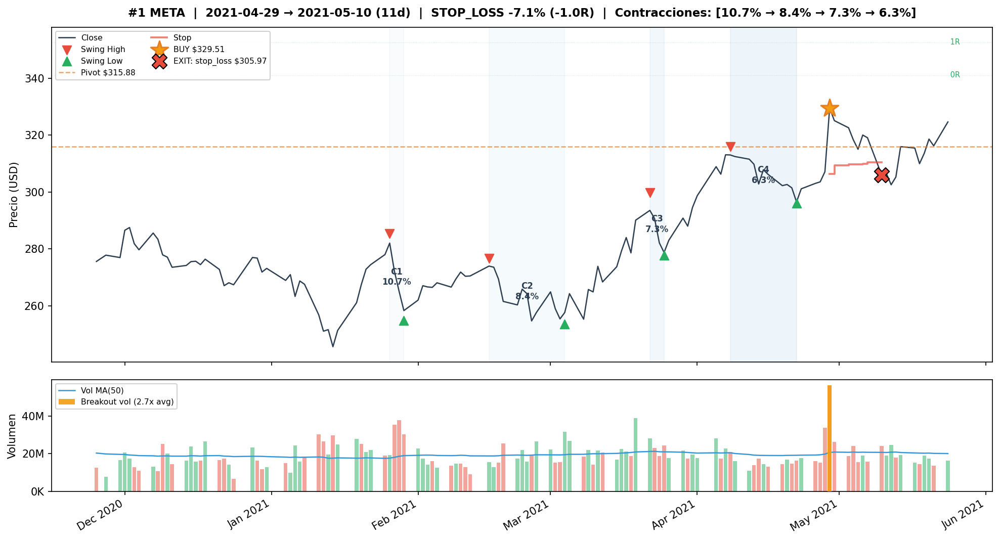
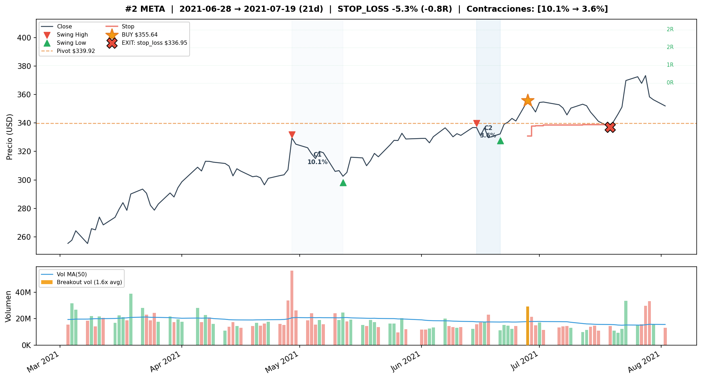
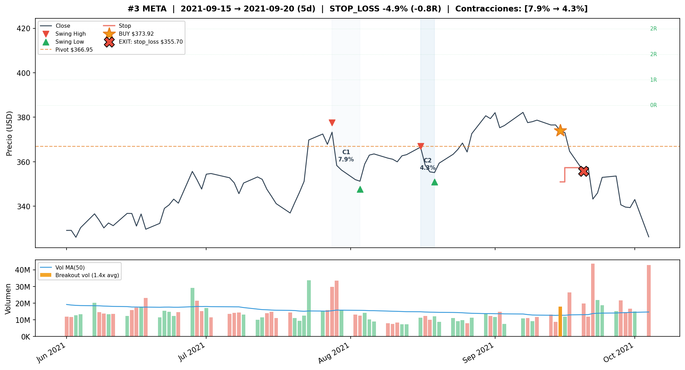
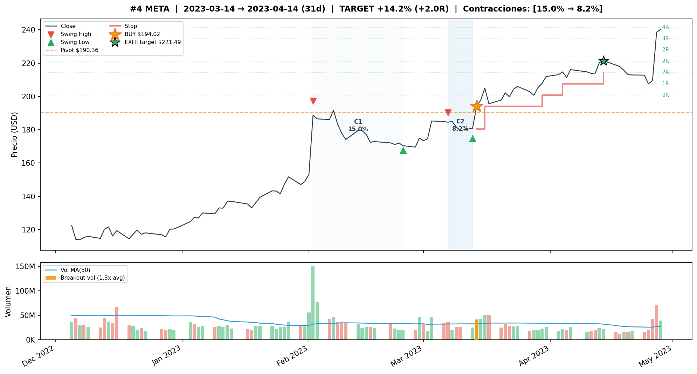
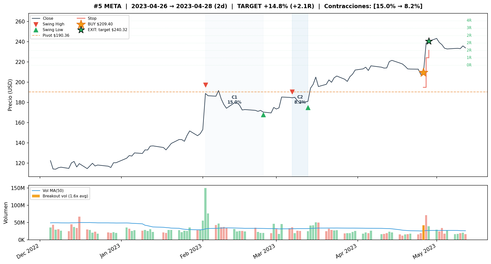
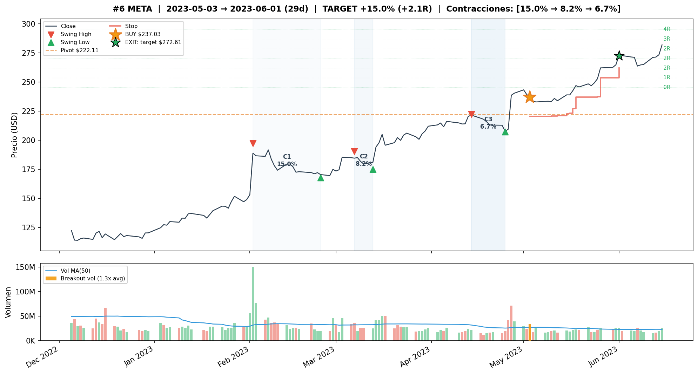
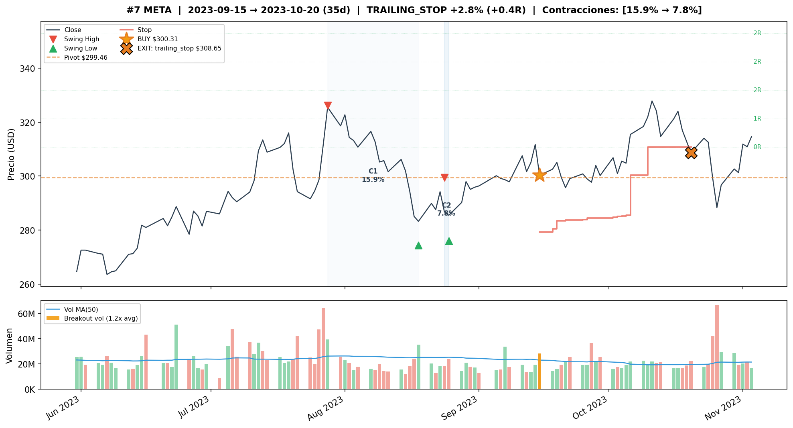
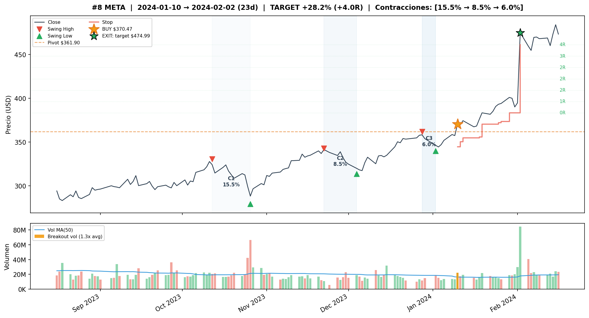
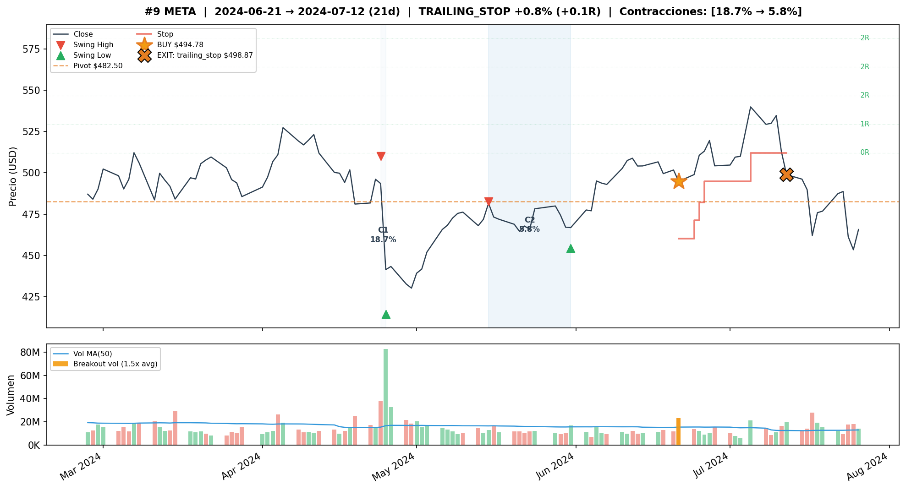

---

## Comparacion Train vs Test

| Metrica | Baseline Train | Baseline Test | BW#1 Train | BW#1 Test | FWD#1 Train | FWD#1 Test |
|---|---|---|---|---|---|---|
| Trades | 14 | **27** | 7 | 12 | 5 | 9 |
| WR | 79% | 56% | 86% | **67%** | **100%** | **67%** |
| CR | +59.56% | **+107.47%** | +45.23% | +83.22% | +43.87% | +67.55% |
| MaxDD | -2.81% | -15.09% | -1.12% | **-10.53%** | 0.00% | -16.31% |
| Sharpe | 1.45 | **0.96** | 1.18 | 0.78 | 1.43 | 0.67 |
| avgR | +1.16 | +0.98 | +0.98 | +0.79 | +1.33 | +0.92 |
| PF | 8.4 | 3.3 | 36.2 | **5.4** | inf | 4.4 |

---

## Observaciones

1. **META es el ticker con mejor performance del proyecto.** Baseline logra +107% CR en test con 27 trades — mas trades que cualquier otro ticker evaluado. Sharpe 0.96 en test es el segundo mas alto (detras de GOOGL COMP#3 con 1.47 pero solo 2 trades).

2. **El baseline sin volume filter supera a todas las variantes con filtro.** 27 trades vs 9-12 con filtro. META genera VCPs de alta frecuencia y calidad — filtrar descarta mas ganadores que perdedores.

3. **La racha mar-jul 2023 del Baseline es excepcional**: 11 trades consecutivos durante el recovery de META post-crash 2022. FWD#1 captura una porcion (trades #4-#6 con +14%/+15%/+15%) pero pierde varios de la cadena por el filtro forward.

4. **FWD#1 captura el trade estrella (2024-01-10, +28.21%)** — el gap post-earnings Q4 2023. Es el trade de mayor retorno del proyecto, y FWD#1 lo retiene.

5. **Forward sobre-filtra en META**: FWD#1 (w1_t1.2_f3) reduce de 12 a 9 trades en test vs BW#1 sin mejorar WR. El forward elimina el trade 2020-10-29 (stop_loss) pero tambien pierde trades ganadores de 2023 (jun-jul).

6. **Los 3 primeros trades de FWD#1 en test (2021) son losses** de -7%/-5%/-5% — senales sin confirmacion forward real que pasaron el filtro backward. El Baseline sufre aun peor con 2 losses de -6% en oct 2020.

7. **FWD#1 no genera trades despues de jun 2024** — el Baseline en cambio produce 5 trades mas (oct 2024, jul-ago 2025), de los cuales los ultimos 2 son losses.

8. **BW#1 (w1_t1.2) tiene el mejor PF (5.4) y menor MaxDD (-10.53%) en test** — la alternativa mas conservadora. Sacrifica retorno absoluto (+83% vs +107%) por mejor risk-adjusted.

9. **FWD#3 (w3_t1.5_f3, tg=5R) captura menos trades (11) pero dos son enormes**: +25.14% (abr-may 2023) y +37.83% (dic 2023 - feb 2024). El early_exit=3 genera 6 early exits que reducen WR a 45%.

10. **compression_threshold=0.95 es dominante para META** — a diferencia de otros tickers que usan 0.85. META necesita un threshold alto porque sus contracciones de ATR son mas sutiles.

---

## Conclusion

**Forward volume confirmation NO mejora para META.** La config recomendada es el **Baseline sin filtro (no_filter, VC=True, tr=1.5, tg=2R, sl=3%)**:

- **+107.47% CR en test** con 27 trades — el mejor resultado absoluto del proyecto
- Sharpe 0.96, PF 3.3, CAGR 12.05%
- Supera ampliamente al B&H en risk-adjusted (MaxDD -15% vs -77% del B&H)
- El trailing tight (tr=1.5) + target fijo (tg=2R) genera alta rotacion: 27 trades en 6.4 anos = ~4.2 trades/ano

META es el ticker ideal para VCP: alta liquidez, breakouts frecuentes con volumen, y tendencias sostenidas post-breakout. El volume contraction filter (VC=True) es suficiente para filtrar ruido — agregar vol_filter backward o forward reduce trade count sin mejorar calidad.

### Alternativa conservadora

Si se prioriza risk-adjusted sobre retorno absoluto, **BW#1 (w1_t1.2, tr=2.5, tg=2R, sl=7%)** ofrece:
- +83.22% CR en test con PF 5.4 y MaxDD -10.53%
- 12 trades con 67% WR
- El vol_filter backward elimina los 2 trades toxicos de oct 2020
