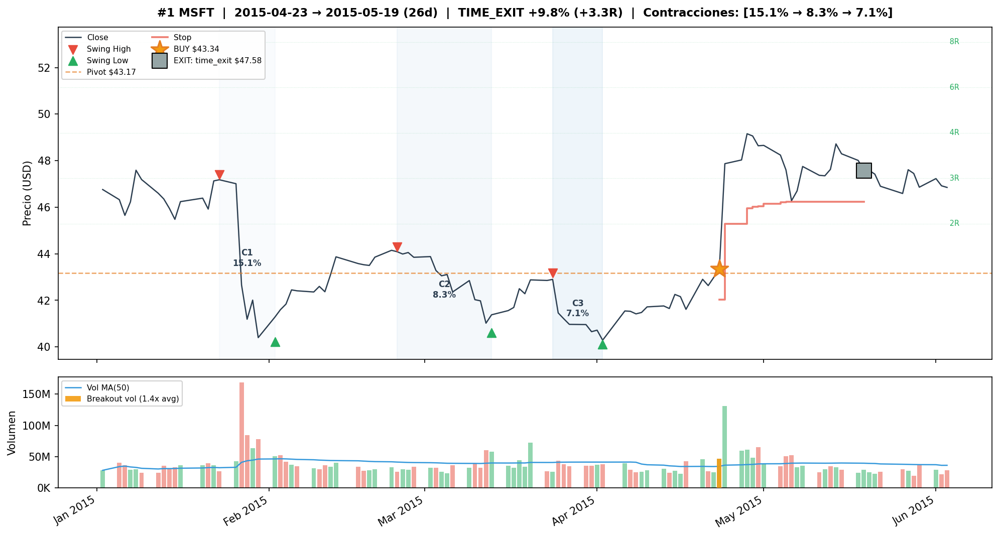
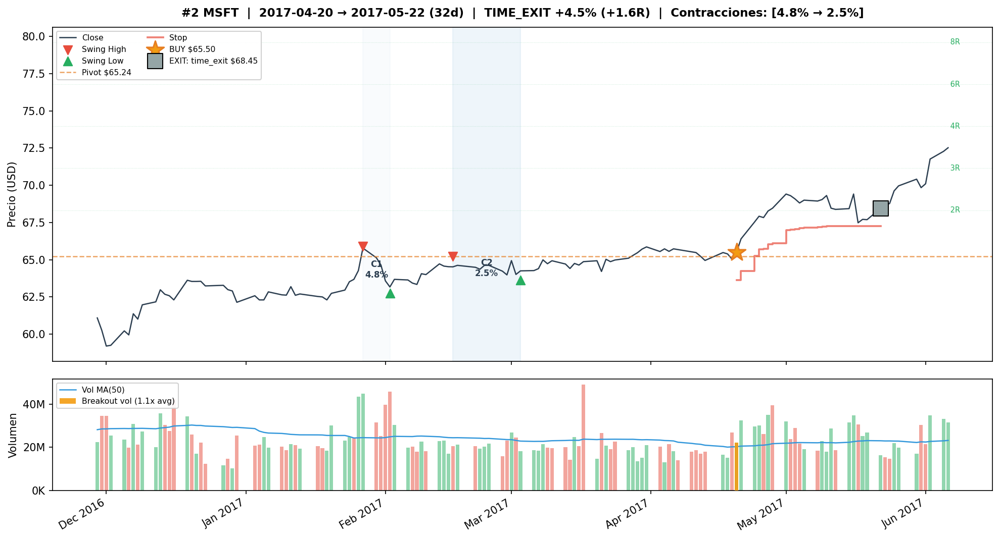
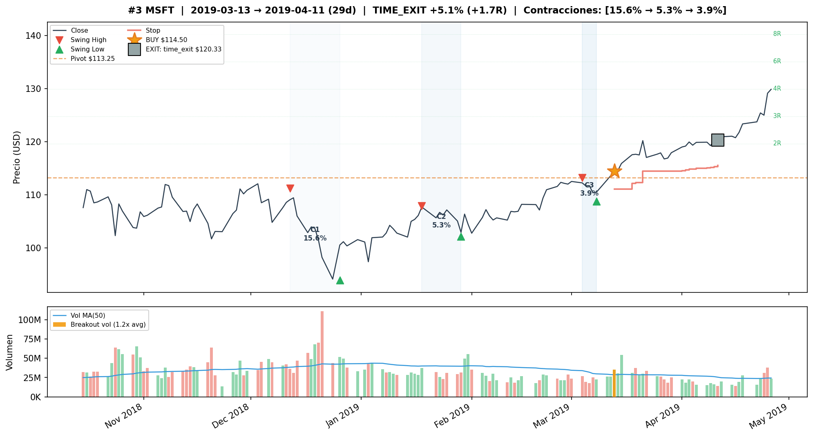
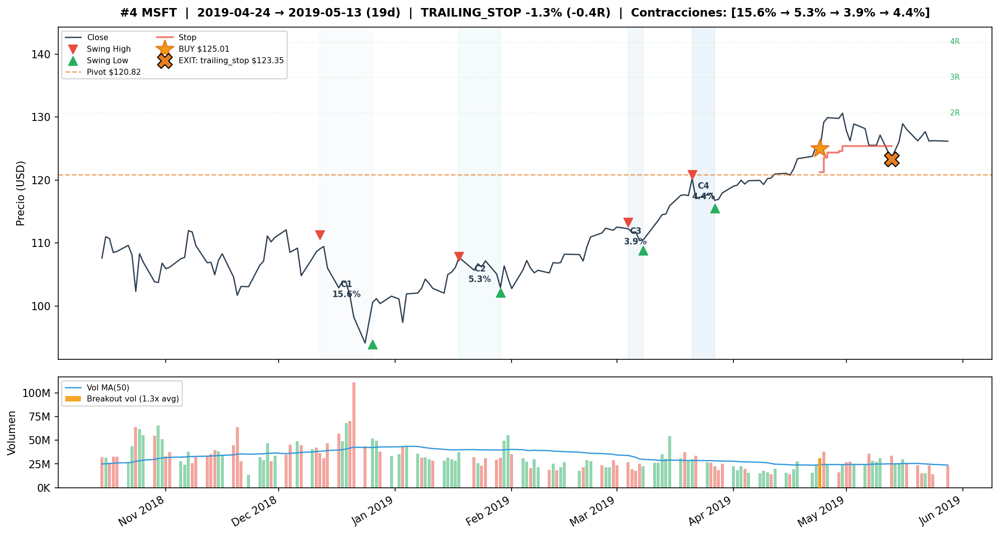
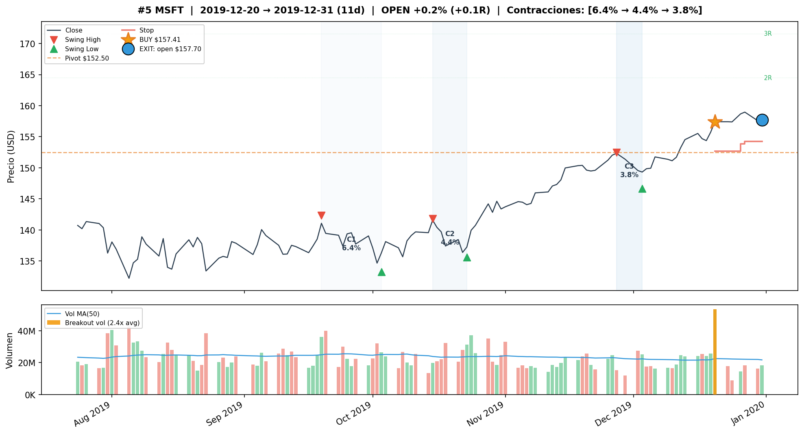
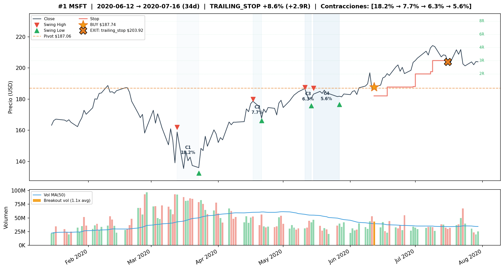
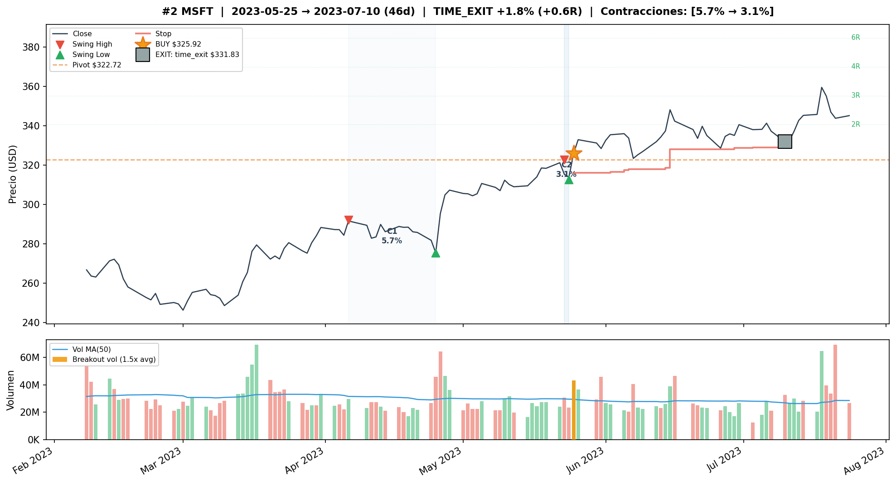
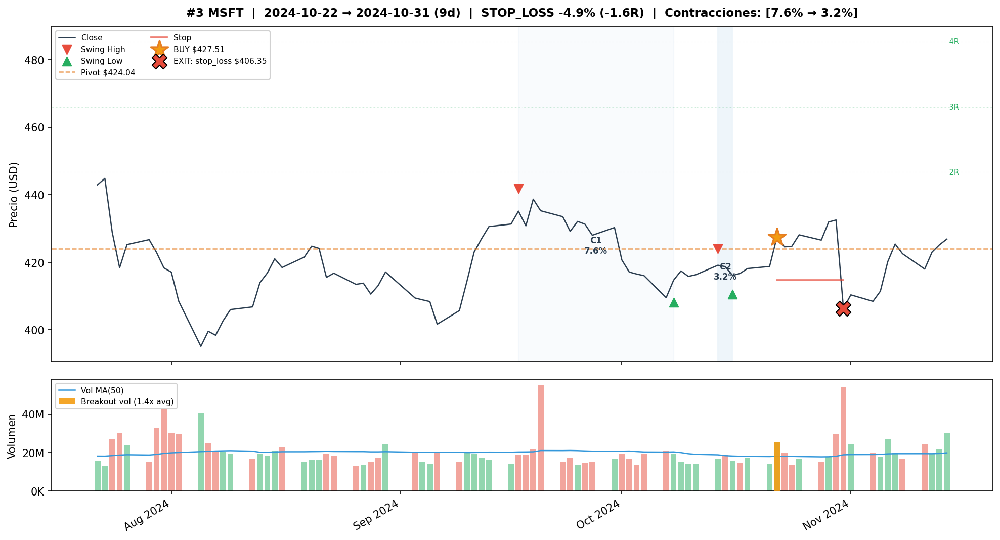
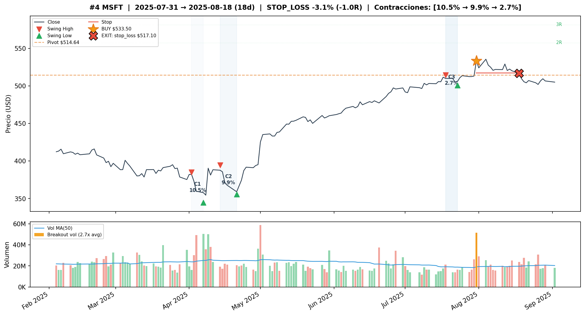

# MSFT — Forward Volume Confirmation v3

## Objetivo

Evaluar si permitir confirmacion de volumen en los N dias posteriores al breakout de precio mejora la robustez de las senales VCP para MSFT, comparado con las configs backward-only de v2.

**Train:** 2015-01-02 a 2019-12-31 (1,258 barras) | **Test:** 2020-01-02 a 2026-04-08 (1,574 barras)
**B&H Train:** CR=+237.25%, MaxDD=-18.58% | **B&H Test:** CR=+133.05%, MaxDD=-37.56%

---

## Metodologia

- Grid search completo (17,496 pipeline runs x 7 variantes de volumen)
- Variantes forward: `w{1,3}_t{1.2,1.5}_f{3,5}` (backward window x threshold x forward days)
- Post-filter: pipeline corre sin volume confirmation, filtro aplicado post-hoc
- Forward: si volumen no confirma backward, busca en N dias siguientes. Si precio se mantiene sobre pivot Y volumen confirma, entra a precio de cierre del dia de confirmacion
- Ranking compuesto: 50% CR + 30% WR + 20% avg_R

---

## Deteccion base

```
atr_mult=2.0, use_close_only=False (HL)
max_depth_atr=None, min_total_reduction=0.60, lookback_bars=126
compression_threshold=0.85, tolerance=0.15
max_depth_pct=0.25, ascending_lows_tolerance=0.03
trend_template=False
```

Las variantes forward usan VC=False. El baseline VC=True usa los mismos params de deteccion pero con volume_contraction=True (ratio<=0.85).

---

## Tabla comparativa — Train (2015-2019)

| Variante | T | W | L | WR | CR | MaxDD | Sharpe | avgR | PF |
|---|---|---|---|---|---|---|---|---|---|
| **Buy & Hold MSFT** | — | — | — | — | +237.25% | -18.58% | — | — | — |
| **FWD#1** w3_t1.2_f3 tr=3.0 be=1.5 sl=3% | 5 | 4 | 1 | 80% | +19.19% | -1.33% | 0.93 | +1.23 | 14.7 |
| **FWD#2** w1_t1.2_f3 tr=3.0 be=1.5 sl=3% | 5 | 4 | 1 | 80% | +17.57% | -1.33% | 0.86 | +1.18 | 13.7 |
| **Baseline** VC=True tr=1.5 be=0.5 sl=3% | 8 | 6 | 2 | 75% | **+39.42%** | -0.55% | **1.43** | +1.44 | **38.1** |
| **Baseline** VC=False tr=3.0 be=1.5 sl=3% | 7 | 5 | 2 | 71% | +29.15% | -3.16% | 0.95 | +1.28 | 8.6 |

---

## Tabla comparativa — Test (2020-2026)

| Variante | T | W | L | WR | CR | MaxDD | Sharpe | avgR | PF |
|---|---|---|---|---|---|---|---|---|---|
| **Buy & Hold MSFT** | — | — | — | — | +133.05% | -37.56% | — | — | — |
| **FWD#1** w3_t1.2_f3 tr=3.0 be=1.5 sl=3% | 4 | 2 | 2 | 50% | +1.88% | -7.87% | 0.09 | +0.20 | 1.3 |
| **FWD#2** w1_t1.2_f3 tr=3.0 be=1.5 sl=3% | 3 | 1 | 2 | 33% | -6.20% | -7.87% | -0.50 | -0.69 | 0.2 |
| **Baseline** VC=True tr=1.5 be=0.5 sl=3% | **5** | **3** | 2 | **60%** | **+4.66%** | **-4.67%** | **0.28** | +0.32 | **2.0** |
| **Baseline** VC=False tr=3.0 be=1.5 sl=3% | 6 | 3 | 3 | 50% | +3.70% | -7.87% | 0.16 | +0.23 | 1.5 |

---

## Configuracion ganadora — Baseline VC=True tr=1.5

**Deteccion:**
```
atr_mult=2.0, use_close_only=False (HL)
max_depth_atr=None, min_total_reduction=0.60, lookback_bars=126
compression_threshold=0.85, tolerance=0.15
max_depth_pct=0.25, ascending_lows_tolerance=0.03
trend_template=False, volume_contraction=True (ratio<=0.85)
vol_filter=no_filter
```

**Salida:**
```
trailing_atr_multiplier=1.5, target_r_multiple=None
early_exit_days=None, breakeven_r_multiple=0.5, max_stop_loss_pct=0.03
max_bars_without_progress=15, min_progress_r=0.5
```

---

## Detalle de trades — FWD#1 Train (5T, 80% WR, +19.19%)

| # | Entry | Exit | Salida | PnL | R | MaxR | Dur |
|---|---|---|---|---|---|---|---|
| 1 | 2015-04-23 | 2015-05-19 | time_exit | +9.78% | +3.3R | 4.5R | 26d |
| 2 | 2017-04-20 | 2017-05-22 | time_exit | +4.50% | +1.6R | 2.1R | 32d |
| 3 | 2019-03-13 | 2019-04-11 | time_exit | +5.09% | +1.7R | 1.7R | 29d |
| 4 | 2019-04-24 | 2019-05-13 | trailing_stop | -1.33% | -0.4R | 1.5R | 19d |
| 5 | 2019-12-20 | 2019-12-31 | open | +0.18% | +0.1R | 0.3R | 11d |

Graficos de los trades en TRAIN: `plots/msft/train/`







## Detalle de trades — FWD#1 Test (4T, 50% WR, +1.88%)

| # | Entry | Exit | Salida | PnL | R | MaxR | Dur |
|---|---|---|---|---|---|---|---|
| 1 | 2020-06-12 | 2020-07-16 | trailing_stop | +8.62% | +2.9R | 4.7R | 34d |
| 2 | 2023-05-25 | 2023-07-10 | time_exit | +1.81% | +0.6R | 2.3R | 46d |
| 3 | 2024-10-22 | 2024-10-31 | stop_loss | -4.95% | -1.6R | 0.4R | 9d |
| 4 | 2025-07-31 | 2025-08-18 | stop_loss | -3.07% | -1.0R | 0.1R | 18d |

Graficos de los trades en TEST: `plots/msft/test/`






---

## Comparacion Train vs Test

| Metrica | FWD#1 Train | FWD#1 Test | Baseline VC Train | Baseline VC Test |
|---|---|---|---|---|
| Trades | 5 | 4 | 8 | 5 |
| WR | 80% | 50% | 75% | **60%** |
| CR | +19.19% | +1.88% | **+39.42%** | **+4.66%** |
| MaxDD | -1.33% | -7.87% | **-0.55%** | **-4.67%** |
| Sharpe | 0.93 | 0.09 | **1.43** | **0.28** |
| avgR | +1.23 | +0.20 | +1.44 | +0.32 |

---

## Observaciones

1. **Baseline VC=True con trailing tight (tr=1.5) es el mejor en test** (+4.66% vs +1.88% del forward). MSFT necesita mas senales activas y un trailing mas ajustado para funcionar.

2. **Forward configs degradan mas que baselines**: muy pocos trades en train (5T), aun menos en test (3-4T). El forward sobre-filtra en MSFT.

3. **FWD#2 es negativo en test** (-6.20%): el filtro w1_t1.2_f3 (backward 1 dia) es demasiado restrictivo para MSFT, dejando solo 3 trades y eliminando el ganador de jun 2020.

4. **Los 2 losses del forward en test (oct-2024, ago-2025) tambien aparecen en el baseline** — no son trades que el forward deberia haber evitado. El forward simplemente tiene menos ganadores para compensar.

5. **MSFT requiere trailing tight (1.5) para capturar ganancias** antes de que reviertan. Con trailing=3.0 (usado en forward configs), el precio retrocede demasiado antes de activar el trailing.

6. **Resultado marginal para todas las variantes**: ninguna supera +5% CR en test.

---

## Conclusion

**Forward volume confirmation no mejora para MSFT.** La config recomendada es el **Baseline VC=True con trailing tight (tr=1.5, be=0.5, sl=3%)**:

- Mejor CR en train (+39.42%) y test (+4.66%)
- Mejor Sharpe en ambos periodos (1.43 train, 0.28 test)
- Menor MaxDD (-0.55% train, -4.67% test)
- Genera mas senales (8 train, 5 test) que las variantes forward

El forward sobre-filtra en MSFT: reduce el trade count sin mejorar la calidad. MSFT tiene breakouts donde el volumen es bajo pero el movimiento sigue siendo valido — el filtro descarta estas senales legitimas.
