# NVDA — Forward Volume Confirmation v3

## Objetivo

Evaluar si permitir confirmacion de volumen en los N dias posteriores al breakout de precio mejora la robustez de las senales VCP para NVDA, comparado con las configs backward-only de v2.

**Train:** 2015-01-02 a 2019-12-31 (1,258 barras) | **Test:** 2020-01-02 a 2026-04-08 (1,574 barras)
**B&H Train:** CR=+1068.79%, MaxDD=-56.08% | **B&H Test:** CR=+2935.78%, MaxDD=-66.36%

---

## Metodologia

- Grid search completo (17,496 pipeline runs x 7 variantes de volumen)
- Variantes forward: `w{1,3}_t{1.2,1.5}_f{3,5}` (backward window x threshold x forward days)
- Post-filter: pipeline corre sin volume confirmation, filtro aplicado post-hoc
- Forward: si volumen no confirma backward, busca en N dias siguientes. Si precio se mantiene sobre pivot Y volumen confirma, entra a precio de cierre del dia de confirmacion
- Ranking compuesto: 50% CR + 30% WR + 20% avg_R

---

## Deteccion base

Dos bases de deteccion evaluadas:

**Forward (y baseline same det):**
```
atr_mult=2.0, use_close_only=False (HL)
max_depth_atr=None, min_total_reduction=0.60, lookback_bars=63
compression_threshold=0.95, tolerance=0.10
max_depth_pct=0.25, ascending_lows_tolerance=0.01
trend_template=False, volume_contraction=False
```

**Baseline best NF (deteccion distinta):**
```
atr_mult=3.0, use_close_only=False (HL)
max_depth_atr=None, min_total_reduction=0.80, lookback_bars=63
compression_threshold=0.85, tolerance=0.10
max_depth_pct=0.25, ascending_lows_tolerance=0.01
trend_template=False, volume_contraction=False
```

---

## Tabla comparativa — Train (2015-2019)

| Variante | T | W | L | WR | CR | MaxDD | Sharpe | avgR | PF |
|---|---|---|---|---|---|---|---|---|---|
| **Buy & Hold NVDA** | — | — | — | — | +1068.79% | -56.08% | — | — | — |
| **FWD#1** w3_t1.2_f3 tr=2.5 be=1.5 sl=3% | 5 | 3 | 2 | 60% | +67.96% | -5.06% | 0.85 | +3.94 | 8.1 |
| **FWD#2** w1_t1.2_f3 tr=2.5 be=1.5 sl=3% | 5 | 3 | 2 | 60% | +67.96% | -5.06% | 0.85 | +3.94 | 8.1 |
| **FWD#3** w3_t1.2_f3 tr=2.5 tg=5R sl=5% | 5 | 3 | 2 | 60% | +61.55% | -10.36% | 0.68 | +2.27 | 4.7 |
| **Baseline NF** (best NF det) tg=5R sl=3% | 3 | 3 | 0 | 100% | +33.67% | 0.00% | 1.16 | +3.46 | inf |
| **Baseline NF** (same det) tr=2.5 be=1.5 sl=3% | 8 | 3 | 5 | 38% | +46.60% | -9.25% | 0.53 | +1.91 | 3.1 |

---

## Tabla comparativa — Test (2020-2026)

| Variante | T | W | L | WR | CR | MaxDD | Sharpe | avgR | PF |
|---|---|---|---|---|---|---|---|---|---|
| **Buy & Hold NVDA** | — | — | — | — | +2935.78% | -66.36% | — | — | — |
| **FWD#1** w3_t1.2_f3 tr=2.5 be=1.5 sl=3% | 5 | 3 | 2 | 60% | +82.15% | -6.84% | 0.79 | +4.61 | 10.9 |
| **FWD#2** w1_t1.2_f3 tr=2.5 be=1.5 sl=3% | **6** | **4** | 2 | **67%** | **+142.36%** | -6.84% | **1.05** | **+5.67** | **15.7** |
| **FWD#3** w3_t1.2_f3 tr=2.5 tg=5R sl=5% | 4 | 3 | 1 | 75% | +89.00% | -2.68% | 1.10 | +3.60 | 27.9 |
| **Baseline NF** (best NF det) tg=5R sl=3% | **0** | — | — | — | — | — | — | — | — |
| **Baseline NF** (same det) tr=2.5 be=1.5 sl=3% | **9** | **6** | 3 | **67%** | **+182.30%** | -5.79% | **1.08** | +4.39 | **14.7** |

---

## Configuracion destacada — FWD#2 w1_t1.2_f3

**Deteccion:**
```
atr_mult=2.0, use_close_only=False (HL)
max_depth_atr=None, min_total_reduction=0.60, lookback_bars=63
compression_threshold=0.95, tolerance=0.10
max_depth_pct=0.25, ascending_lows_tolerance=0.01
trend_template=False, volume_contraction=False
vol_filter=w1_t1.2_f3 (backward 1 dia, threshold 1.2x, forward 3 dias)
```

**Salida:**
```
trailing_atr_multiplier=2.5, target_r_multiple=None
early_exit_days=None, breakeven_r_multiple=1.5, max_stop_loss_pct=0.03
max_bars_without_progress=15, min_progress_r=0.5
```

---

## Detalle de trades — FWD#2 Train (5T, 60% WR, +67.96%)

| # | Entry | Exit | Salida | PnL | R | MaxR | Dur |
|---|---|---|---|---|---|---|---|
| 1 | 2015-03-20 | 2015-03-23 | stop_loss | -3.24% | -1.1R | 0.0R | 3d |
| 2 | 2017-05-10 | 2017-06-09 | trailing_stop | +23.34% | +7.8R | 10.6R | 30d |
| 3 | 2017-09-15 | 2017-09-25 | stop_loss | -5.06% | -1.7R | 1.4R | 10d |
| 4 | 2017-09-26 | 2017-11-29 | trailing_stop | +14.22% | +4.7R | 8.7R | 64d |
| 5 | 2019-10-03 | 2019-12-31 | open | +29.78% | +9.9R | 10.7R | 89d |

Graficos de los trades en TRAIN: `plots/nvda/train/`

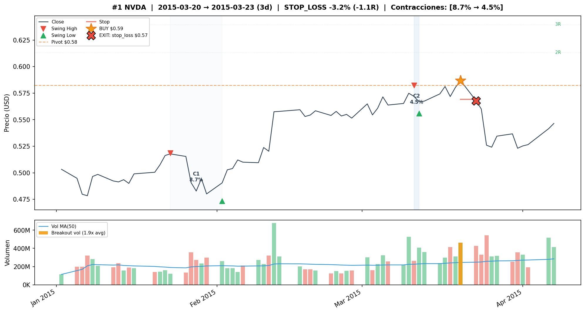
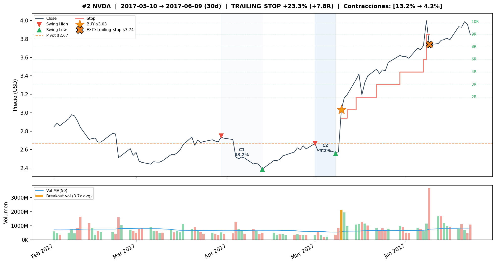
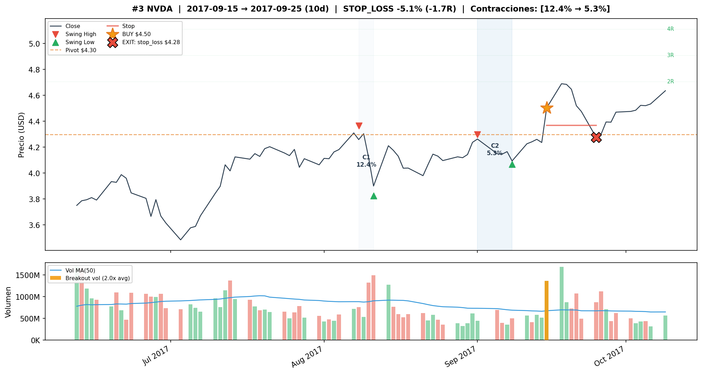
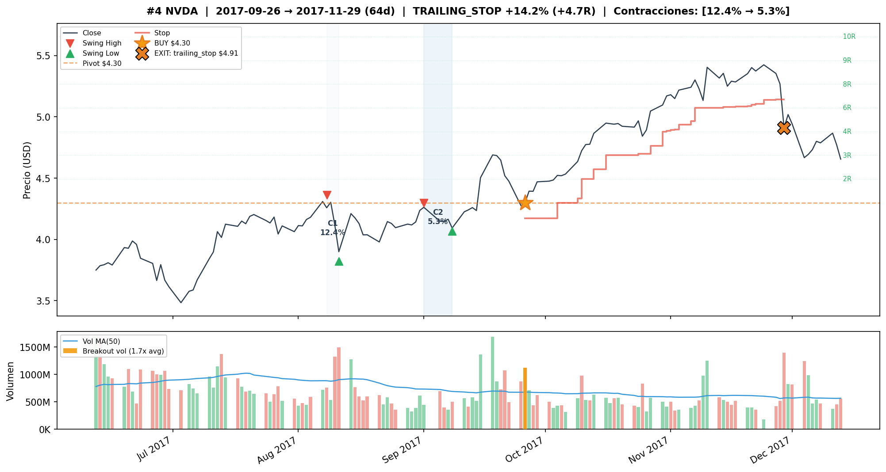
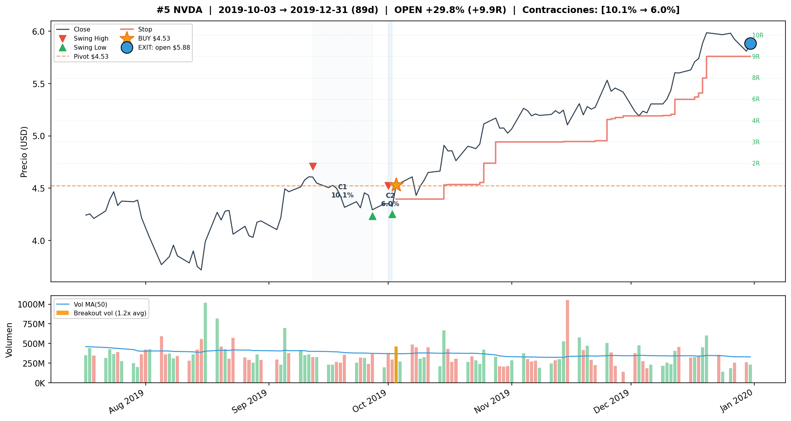

## Detalle de trades — FWD#2 Test (6T, 67% WR, +142.36%)

| # | Entry | Exit | Salida | PnL | R | MaxR | Dur |
|---|---|---|---|---|---|---|---|
| 1 | 2023-05-01 | 2023-05-03 | stop_loss | -3.83% | -1.3R | 0.0R | 2d |
| 2 | 2023-05-18 | 2023-05-23 | stop_loss | -3.13% | -1.0R | 0.0R | 5d |
| 3 | 2023-05-24 | 2023-06-26 | trailing_stop | **+33.05%** | +11.0R | 14.5R | 33d [fwd+2d] |
| 4 | 2024-01-08 | 2024-02-20 | trailing_stop | +32.91% | +11.0R | 13.8R | 43d |
| 5 | 2024-02-21 | 2024-03-08 | trailing_stop | +29.72% | +9.9R | 12.4R | 16d |
| 6 | 2025-06-25 | 2025-08-21 | trailing_stop | +13.40% | +4.5R | 6.2R | 57d |

Graficos de los trades en TEST: `plots/nvda/test/`

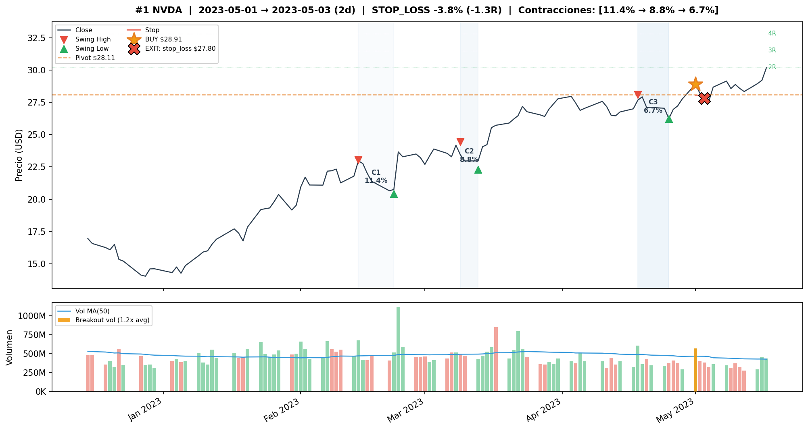
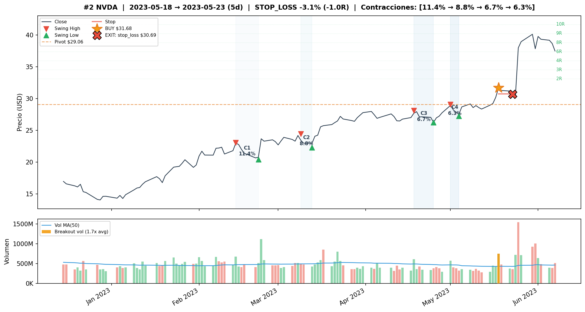
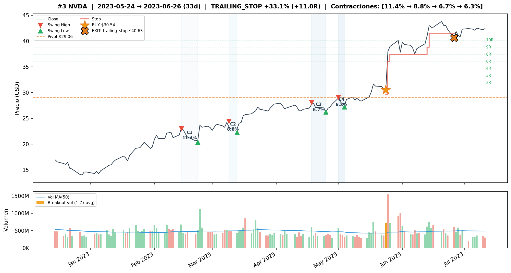
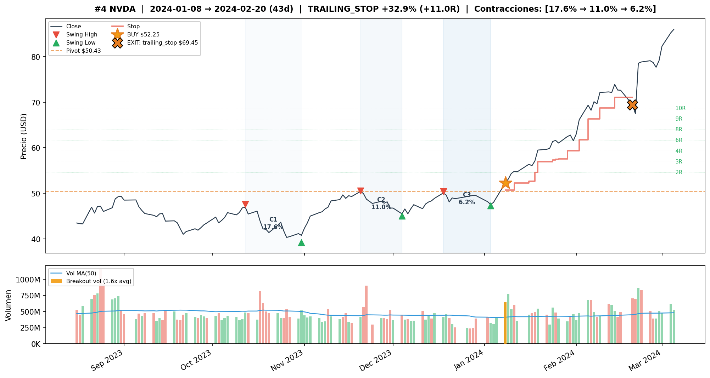
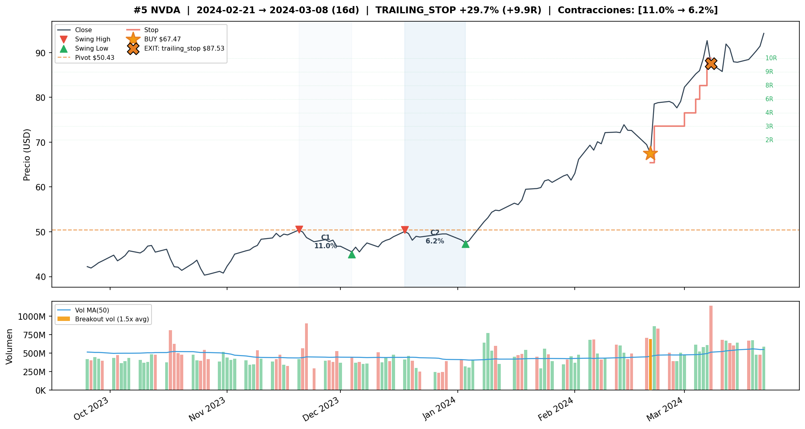
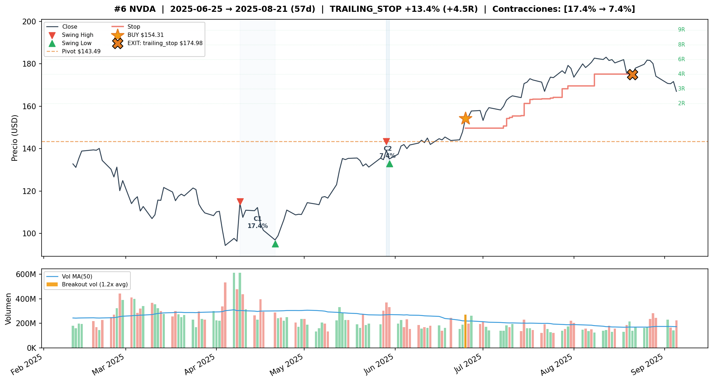

---

## Comparacion Train vs Test

| Metrica | FWD#2 Train | FWD#2 Test | Baseline (same det) Train | Baseline (same det) Test |
|---|---|---|---|---|
| Trades | 5 | 6 | 8 | 9 |
| WR | 60% | 67% | 38% | 67% |
| CR | +67.96% | +142.36% | +46.60% | **+182.30%** |
| MaxDD | -5.06% | -6.84% | -9.25% | -5.79% |
| Sharpe | 0.85 | 1.05 | 0.53 | 1.08 |
| avgR | +3.94 | +5.67 | +1.91 | +4.39 |

---

## Observaciones

1. **FWD#2 (w1_t1.2_f3) captura un trade extra en test** via forward: el trade #3 del 2023-05-24 [fwd+2d] con +33.05%. Este trade no existia en la version backward porque el volumen no confirmo el dia del breakout sino 2 dias despues.

2. **Pero el baseline sin filtro con mismos params de deteccion supera a todos** (+182% vs +142%): NVDA es tan explosivo (B&H test +2935%) que filtrar trades buenos cuesta mas que evitar malos. El baseline captura 9 trades (3 mas que FWD#2).

3. **FWD#3 con target=5R tiene el mejor risk-adjusted** — PF 27.9 y menor MaxDD (-2.68%), es la config mas controlada.

4. **Baseline best NF (atr=3.0, red=0.8) produce 0 trades en test** — sobre-ajustado a train. La deteccion mas restrictiva no genera senales en el regimen post-2020.

5. **lookback_bars=63 sigue siendo unico de NVDA** — consistente con v2.

6. **Los trades de NVDA son explosivos**: 4 trades de +29% a +33% en test. Los movimientos de AI/semiconductores 2023-2024 generan VCPs de altisima calidad.

---

## Conclusion

**Forward volume confirmation tiene resultado mixto para NVDA.** FWD#2 captura +142% en test vs +182% del baseline sin filtro. El forward agrega un trade valido (+33% via forward confirmation), pero el baseline sin filtro captura aun mas trades explosivos.

La recomendacion depende del perfil de riesgo:
- **FWD#3** (tg=5R): para quien prioriza risk-adjusted (PF 27.9, MaxDD -2.68%)
- **Baseline sin filtro**: para quien prioriza retorno absoluto (+182%, 9 trades)
- **FWD#2**: punto medio (+142%, 6 trades, Sharpe 1.05)

NVDA es el unico ticker donde filtrar de mas cuesta significativamente — sus VCPs son de tan alta calidad que cualquier filtro adicional descarta mas ganadores que perdedores.
