# TSLA — Forward Volume Confirmation v3

## Objetivo

Evaluar si permitir confirmacion de volumen en los N dias posteriores al breakout de precio mejora la robustez de las senales VCP para TSLA, comparado con las configs backward-only de v2.

**Train:** 2015-01-02 a 2019-12-31 (1,258 barras) | **Test:** 2020-01-02 a 2026-06-09 (1,617 barras)
**B&H Train:** CR=+90.75%, MaxDD=-53.51% | **B&H Test:** CR=+1282.93%, MaxDD=-73.63%

---

## Metodologia

- Grid search completo (17,496 pipeline runs x 7 variantes de volumen)
- Variantes forward: `w{1,3}_t{1.2,1.5}_f{3,5}` (backward window x threshold x forward days)
- Post-filter: pipeline corre sin volume confirmation, filtro aplicado post-hoc
- Forward: si volumen no confirma backward, busca en N dias siguientes. Si precio se mantiene sobre pivot Y volumen confirma, entra a precio de cierre del dia de confirmacion
- Ranking compuesto: 50% CR + 30% WR + 20% avg_R

---

## Deteccion base

Una base de deteccion dominante con variacion en max_depth_atr:

**COMP#1/FWD#1 (mda=None):**
```
atr_mult=2.0, use_close_only=True (Close)
max_depth_atr=None, min_total_reduction=0.80, lookback_bars=126
compression_threshold=0.95, tolerance=0.10
max_depth_pct=0.35, ascending_lows_tolerance=0.08
trend_template=False, volume_contraction=False
```

**COMP#3/FWD#3/Baseline (mda=8):**
```
atr_mult=2.0, use_close_only=True (Close)
max_depth_atr=8, min_total_reduction=0.80, lookback_bars=126
compression_threshold=0.95, tolerance=0.10
max_depth_pct=0.35, ascending_lows_tolerance=0.08
trend_template=False, volume_contraction=False
```

---

## Tabla comparativa — Train (2015-2019)

| Variante | T | W | L | WR | CR | MaxDD | Sharpe | avgR | PF |
|---|---|---|---|---|---|---|---|---|---|
| **Buy & Hold TSLA** | — | — | — | — | +90.75% | -53.51% | — | — | — |
| **COMP#1** w3_t1.5 tr=1.5 tg=5R sl=7% | 4 | 4 | 0 | **100%** | **+130.87%** | **0.00%** | **1.82** | **+3.41** | **inf** |
| **COMP#3** w1_t1.2 tr=1.5 tg=5R sl=7% | 5 | 5 | 0 | **100%** | +115.03% | **0.00%** | 1.37 | +2.46 | **inf** |
| **Baseline** no_filter tr=1.5 tg=5R sl=5% | **9** | 7 | 2 | 78% | +99.53% | -11.18% | 0.90 | +1.75 | 7.8 |
| **FWD#1** w3_t1.5_f3 tr=1.5 tg=5R sl=7% | 4 | 4 | 0 | **100%** | **+130.87%** | **0.00%** | **1.82** | **+3.41** | **inf** |
| **FWD#3** w1_t1.2_f3 tr=1.5 tg=5R sl=7% | 5 | 5 | 0 | **100%** | +115.03% | **0.00%** | 1.37 | +2.46 | **inf** |

---

## Tabla comparativa — Test (2020-2026)

| Variante | T | W | L | WR | CR | MaxDD | Sharpe | avgR | PF |
|---|---|---|---|---|---|---|---|---|---|
| **Buy & Hold TSLA** | — | — | — | — | +1282.93% | -73.63% | — | — | — |
| **COMP#1** w3_t1.5 tr=1.5 tg=5R sl=7% | 7 | 5 | 2 | **71%** | **+79.63%** | **-7.18%** | **0.70** | **+1.37** | **9.6** |
| **COMP#3** w1_t1.2 tr=1.5 tg=5R sl=7% | 8 | 4 | 4 | 50% | +35.87% | -17.28% | 0.44 | +0.64 | 2.9 |
| **Baseline** no_filter tr=1.5 tg=5R sl=5% | **19** | 9 | 10 | 47% | +47.82% | -20.91% | 0.44 | +0.50 | 2.3 |
| **FWD#1** w3_t1.5_f3 tr=1.5 tg=5R sl=7% | 7 | 5 | 2 | **71%** | **+79.63%** | **-7.18%** | **0.70** | **+1.37** | **9.6** |
| **FWD#3** w1_t1.2_f3 tr=1.5 tg=5R sl=7% | 8 | 4 | 4 | 50% | +35.87% | -17.28% | 0.44 | +0.64 | 2.9 |

---

## Configuracion destacada v3 — FWD#1 w3_t1.5_f3

**Deteccion:**
```
atr_mult=2.0, use_close_only=True (Close)
max_depth_atr=None, min_total_reduction=0.80, lookback_bars=126
compression_threshold=0.95, tolerance=0.10
max_depth_pct=0.35, ascending_lows_tolerance=0.08
trend_template=False, volume_contraction=False
vol_filter=w3_t1.5_f3 (backward 3 dias, threshold 1.5x, forward 3 dias)
```

**Salida:**
```
trailing_atr_multiplier=1.5, target_r_multiple=5.0
early_exit_days=None, breakeven_r_multiple=0.5, max_stop_loss_pct=0.07
max_bars_without_progress=15, min_progress_r=0.5
```

---

## Detalle de trades — FWD#1 Train (4T, 100% WR, +130.87%)

| # | Entry | Exit | Salida | PnL | R | MaxR | Dur |
|---|---|---|---|---|---|---|---|
| 1 | 2015-04-08 | 2015-07-07 | trailing_stop | +28.99% | +4.1R | 5.0R | 90d |
| 2 | 2015-07-08 | 2015-07-21 | trailing_stop | +4.63% | +0.7R | 1.5R | 13d |
| 3 | 2019-10-14 | 2019-11-12 | target | +36.18% | +5.2R | 5.2R | 29d |
| 4 | 2019-11-22 | 2019-12-31 | open | +25.61% | +3.7R | 4.2R | 39d |

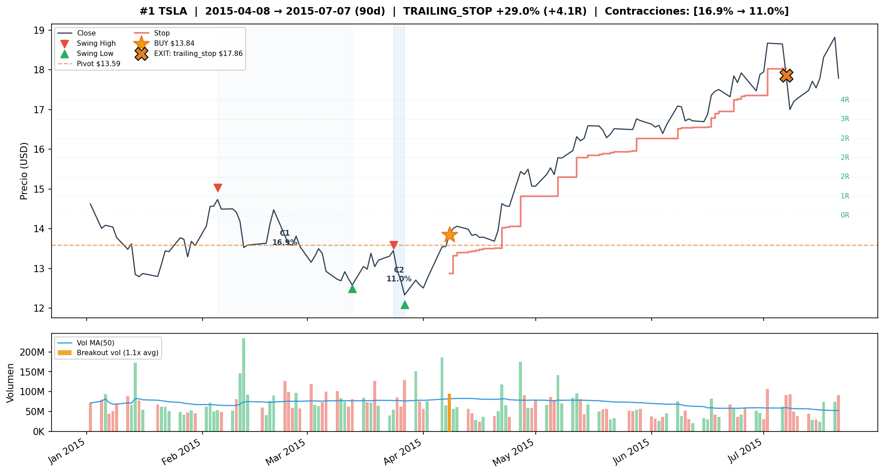
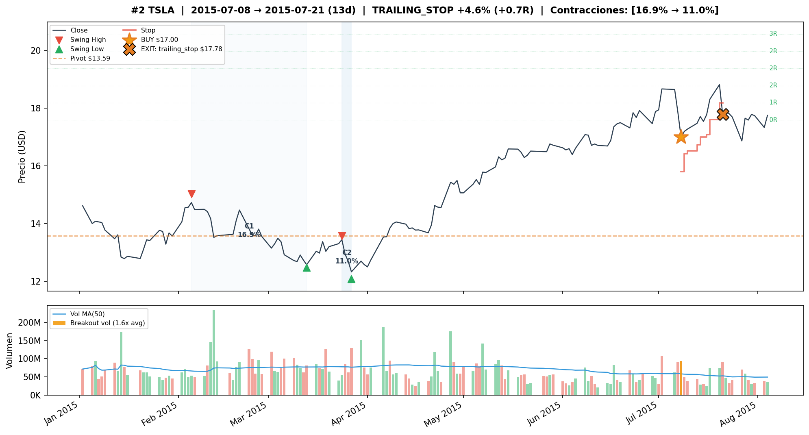
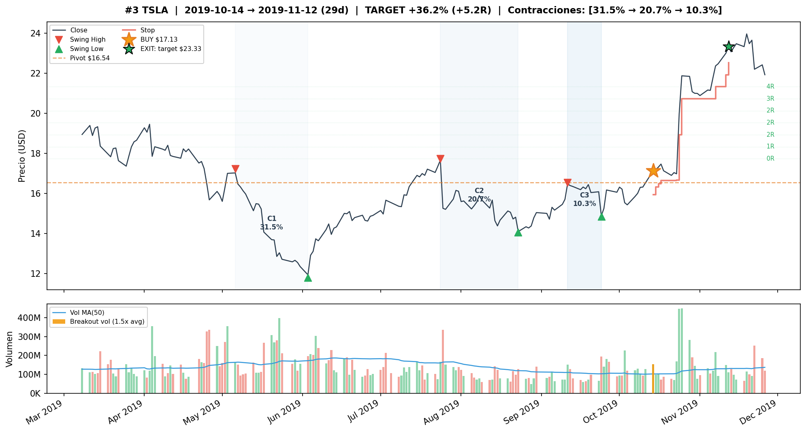
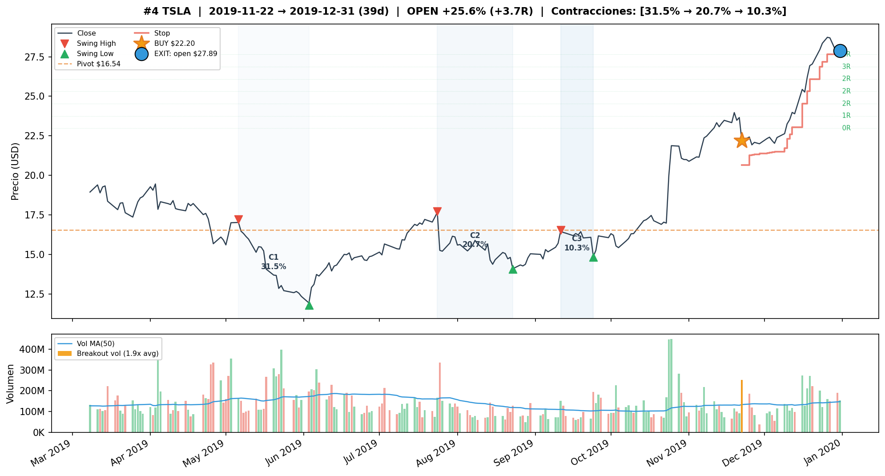

## Detalle de trades — FWD#1 Test (7T, 71% WR, +79.63%)

| # | Entry | Exit | Salida | PnL | R | MaxR | Dur |
|---|---|---|---|---|---|---|---|
| 1 | 2020-11-18 | 2020-12-09 | trailing_stop | +24.22% | +3.5R | 4.8R | 21d |
| 2 | 2020-12-10 | 2020-12-21 | trailing_stop | +3.63% | +0.5R | 1.5R | 11d |
| 3 | 2020-12-22 | 2021-01-08 | target | +37.43% | +5.3R | 5.3R | 17d |
| 4 | 2021-01-11 | 2021-01-28 | trailing_stop | +2.99% | +0.4R | 1.3R | 17d |
| 5 | 2024-10-25 | 2024-10-31 | stop_loss | -7.18% | -1.0R | 0.0R | 6d |
| 6 | 2025-09-12 | 2025-09-25 | trailing_stop | +6.93% | +1.0R | 1.7R | 13d |
| 7 | 2025-10-02 | 2025-10-07 | trailing_stop | -0.67% | -0.1R | 0.6R | 5d |

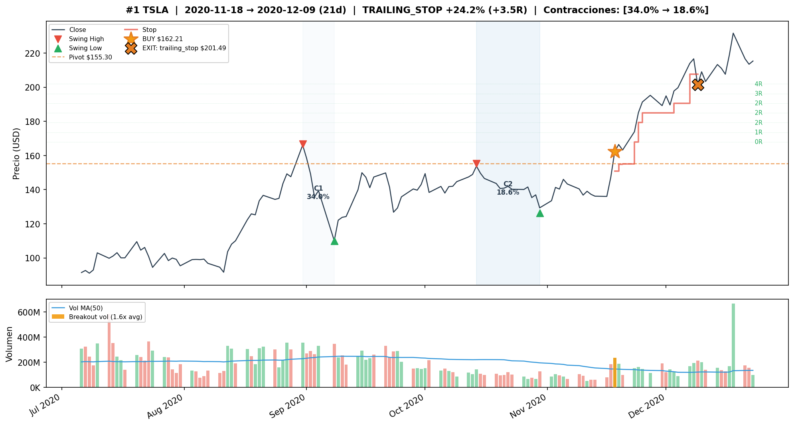
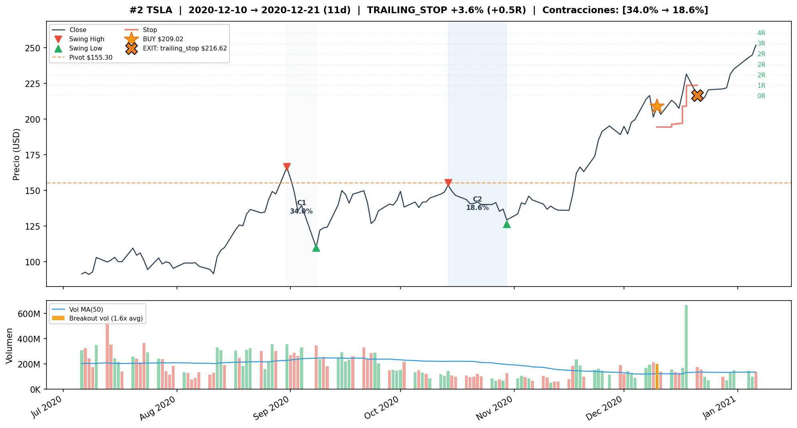
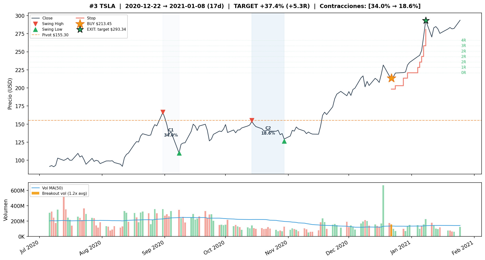
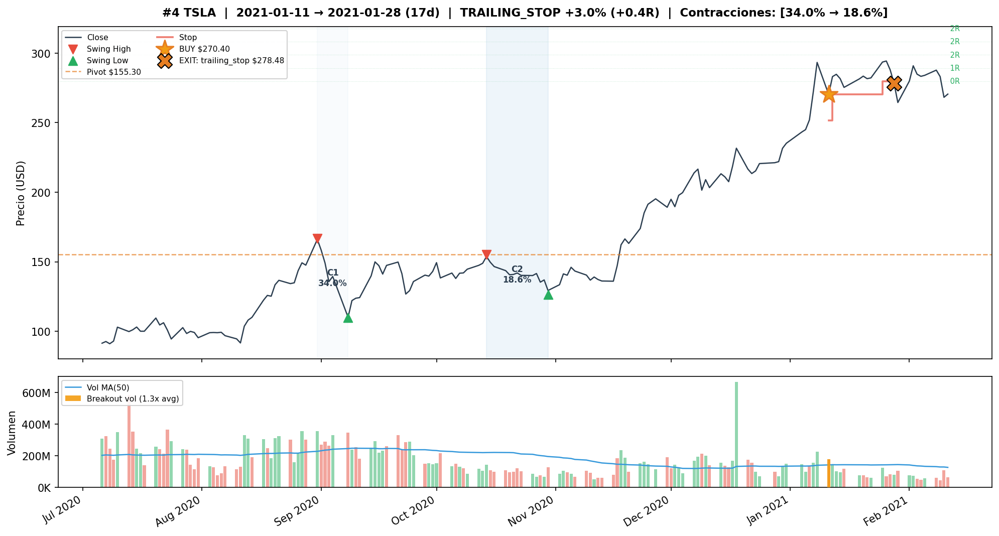
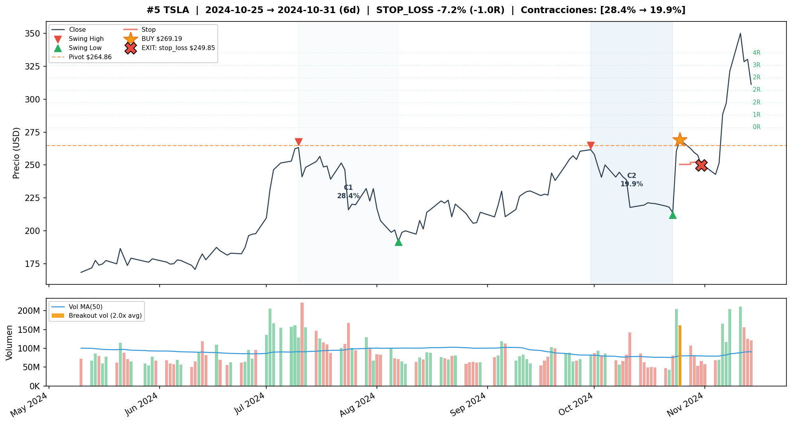
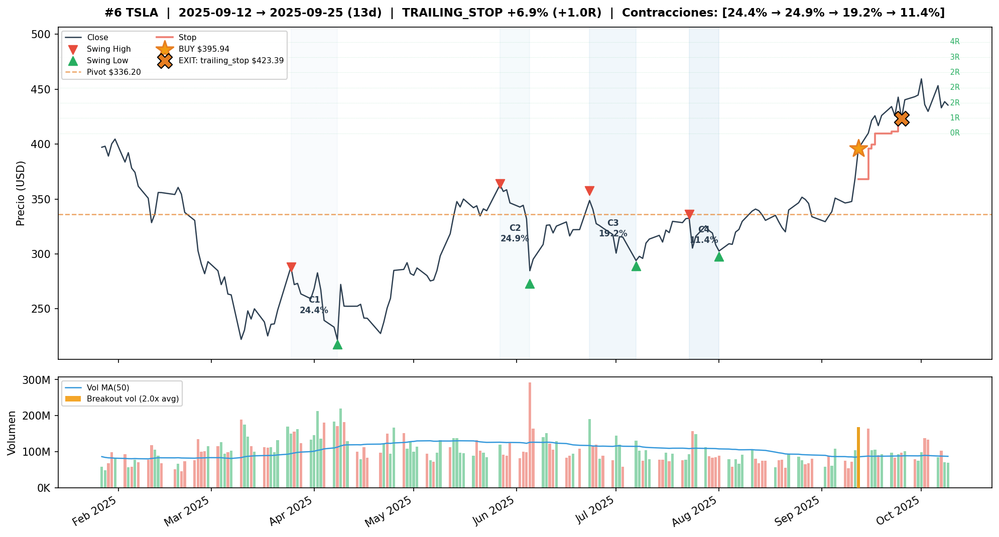
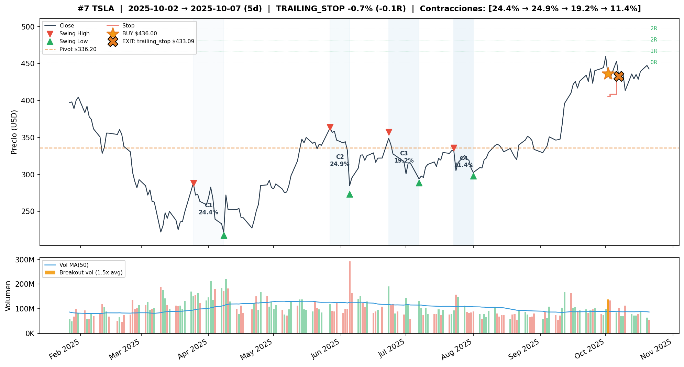

---

## Comparacion Train vs Test

| Metrica | COMP#1 Train | COMP#1 Test | FWD#1 Train | FWD#1 Test | Baseline Train | Baseline Test |
|---|---|---|---|---|---|---|
| Trades | 4 | 7 | 4 | 7 | 9 | **19** |
| WR | **100%** | **71%** | **100%** | **71%** | 78% | 47% |
| CR | **+130.87%** | **+79.63%** | **+130.87%** | **+79.63%** | +99.53% | +47.82% |
| MaxDD | 0.00% | **-7.18%** | 0.00% | **-7.18%** | -11.18% | -20.91% |
| Sharpe | **1.82** | **0.70** | **1.82** | **0.70** | 0.90 | 0.44 |
| avgR | **+3.41** | **+1.37** | **+3.41** | **+1.37** | +1.75 | +0.50 |
| PF | **inf** | **9.6** | **inf** | **9.6** | 7.8 | 2.3 |

---

## Observaciones

1. **Forward volume confirmation NO agrega trades para TSLA.** FWD#1 y COMP#1 producen exactamente los mismos trades en train Y test. FWD#3 y COMP#3 tambien son identicos. Los breakouts de TSLA que pasan el vol_filter backward ya tienen volumen en el dia del breakout — nunca necesitan forward confirmation.

2. **TSLA es el unico ticker donde forward = backward con 100% de coincidencia.** En otros tickers (AAPL, NVDA, META), forward agrega o modifica al menos algunos trades. En TSLA, cero diferencia.

3. **La razon es structural**: TSLA tiene breakouts explosivos con gaps de volumen masivos. Si el volumen no confirma en el dia del breakout, es porque no hubo breakout real — no es un caso de "volumen retrasado" que forward podria capturar.

4. **COMP#1 (w3_t1.5) sigue siendo la config optima** con +79.63% CR en test, PF 9.6, MaxDD -7.18%. Solo 7 trades en 6.4 anos (~1.1 trades/ano), pero cada trade ganador es explosivo (avg winner +15%).

5. **El rally nov 2020 - ene 2021 es el motor del test**: 4 trades consecutivos durante la inclusion de TSLA en S&P 500, incluyendo el target 5R de +37.43% (22 dic 2020 - 8 ene 2021).

6. **Gran brecha 2021-2024 sin trades**: 3.5 anos entre el ultimo trade de ene 2021 y oct 2024. TSLA paso por su crash -74% (nov 2021 - dic 2022) y recovery sin generar VCPs detectables con estos parametros.

7. **El Baseline es significativamente peor en test**: 19 trades con WR 47% y CR +47.82%. La rafaga de 9 trades en sep-nov 2025 genera mucho ruido (7 trailing stops de resultado mixto). El vol_filter w3_t1.5 es esencial para TSLA.

8. **COMP#3 (w1_t1.2) sufre en test**: WR baja de 100% a 50%, CR solo +35.87%. El filtro w1_t1.2 es menos selectivo que w3_t1.5 y admite 1 trade extra en test (aug 2021, -3.31%) que diluye performance.

9. **El unico loss de COMP#1 en test es oct 2024** (-7.18%, breakout fallido post-earnings Q3 2024). Es inevitable con max_stop_loss_pct=0.07 — el trade #7 (-0.67%) es practicamente break-even.

10. **La estabilidad entre exit profiles es la mas alta del proyecto** (0.96 tight-medium, 0.95 tight-loose). TSLA tiene tan pocos trades que la eleccion de salida importa menos.

---

## Conclusion

**Forward volume confirmation NO mejora para TSLA.** La config recomendada es el **COMP#1 backward-only (w3_t1.5, tr=1.5, tg=5R, sl=7%)**:

- +130.87% CR en train (4T, 100% WR, Sharpe 1.82) — zero drawdown
- +79.63% CR en test (7T, 71% WR, Sharpe 0.70) — PF 9.6, MaxDD -7.18%
- No supera al B&H absoluto (+1283%), pero MaxDD -7% vs -74% del B&H
- ~1.1 trades/ano: TSLA genera VCPs infrecuentes pero de altisima calidad

TSLA es un ticker atipico en el proyecto: pocos trades, todos explosivos, y la confirmacion forward nunca se activa porque los breakouts ya vienen con volumen masivo. El valor del vol_filter es puramente backward — filtra los 2-5 breakouts debiles que destruyen performance.

### Particularidades de TSLA vs otros tickers

| Caracteristica | TSLA | Otros tickers |
|---|---|---|
| use_close_only | True (Close) | False (HL) tipicamente |
| max_depth_pct | 0.35 | 0.25 |
| ascending_lows_tol | 0.08 | 0.01 |
| trend_template | 0 trades | Funcional |
| Forward vs backward | Identicos | Diferente generalmente |
| Trades/ano test | ~1.1 | 2-4 |
